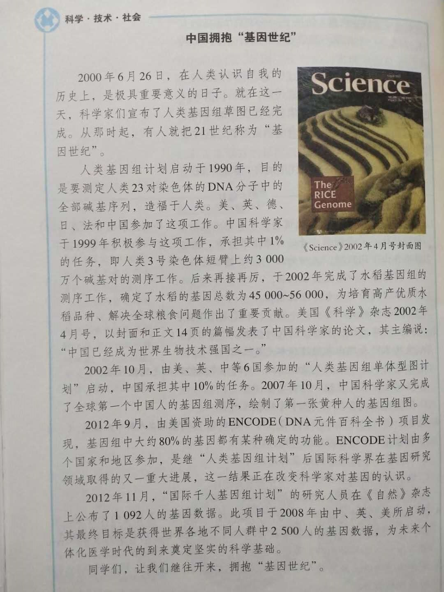
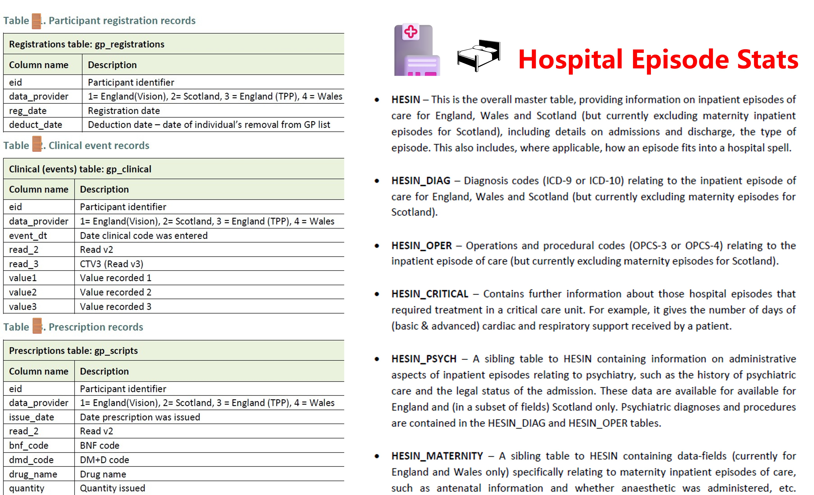
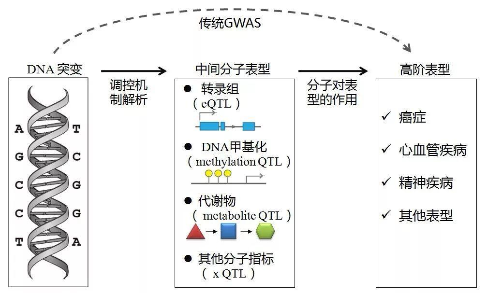

## 🧬1. Gen数据和Phe数据

### 初二生物学课本



### 📍1.1 [HAPMAP3 genotype 数据](https://www.broadinstitute.org/medical-and-population-genetics/hapmap-3), 1百多万个SNP，一般作为 LD 计算的 reference panel。

### 📍1.2 [千人基因组项目数据](https://www.internationalgenome.org/data)， 将近1亿个SNP，一般作为 imputation 的 reference panel。

### 📍1.3 UKB 数据，现在推荐用[UKB RAP](https://dnanexus.gitbook.io/uk-biobank-rap)。

```
1. 最新数据通知 https://community.ukbiobank.ac.uk/hc/en-gb/articles/26088595922333-New-and-Updated-Data
2. UKB RAP：https://ukbiobank.dnanexus.com/landing
```
<br/>


## 🧬2. GWAS



### 📍2.1 GWAS数据获取，最经典的是[GWAS Catalog](https://www.ebi.ac.uk/gwas)。

### 📍2.2 GWAS数据QC示例 【本课题组建议GWAS列名称： SNP CHR POS CHRPOS ⭐ EA NEA EAF N ⭐ BETA SE Z P】
```
1. 确保文件每一行的列数目是一样的。将连续空格中插入NA，扣好第一粒纽扣。
   zcat GWAS.gz | awk '{print NF}' | sort -nu | wc -l 
   sed 's/^\t/NA\t/; s/\t\t/\tNA\t/g; s/\t\t/\tNA\t/g; s/\t$/\tNA/'。
2. 按照CHR和POS排序，否则pheweb 会报错
   sort -k 1,1V -k 2,2n # -V是为了把chrX和chrY排到最后，但是需要把第一行先写到新文件里。
3. GWAS数据本身的问题：
   (1) Allele 最好是大写，awk 和 R 都有 toupper()功能。
   (2) P值最好不要小于1e-312，awk 会把其当成0，有一些软件（比如LDSC）也会报错，这个时候要么用Z值，要么人为将这些P值设为1e-300。
   (3) BETA|SE|P出现“三缺一” 的情况： b = se * qnorm(p/2); se = abs(b/qnorm(p/2)); se = (CI_upper - CI_lower)/(1.96*2); p = 2*pnorm(-abs(b/se))

对检查没问题的GWAS，深加工示例：

1. 🚜liftOver 
   dat=XYZ; head -1 $dat.txt > $dat.sorted; tail -n +2 $dat.txt | sort -k 1,1V -k 2,2n > $dat.sorted
   python ~/scripts/f/add_rsid.py -i $dat.sorted --sep "\t" --chr CHR --pos POS --ref NEA --alt EA -d ~/data/dbsnp/rsids-v154-hg19.tsv.gz -o $dat.tmp1
   cat $dat.tmp1 | awk 'NR >1 {print "chr"$1, $2 -1, $2, $9}' | sed 's/^chr23/chrX/' > $dat.tolift
   liftOver $dat.tolift /work/sph-huangj/files/hg19ToHg38.over.chain.gz $dat.lifted $dat.unmapped
   cut -f 3,4 $dat.lifted > $dat.pos_snp
   python ~/scripts/f/join_file.py -i "$dat.tmp1,TAB,8 $dat.pos_snp,TAB,1" -o $dat.tmp2
   cut -d " " -f 1-10 $dat.tmp2 | sed '1s/POS/POS.37/; 1s/NA/POS/' | gzip -f > clean/$dat.gz

2. ⛄跟其他数据合并 
   python scripts/library/join_file.py -i "$dat,TAB,0 $dat.lifted.3col,TAB,2" -o $dat.NEW.tmp
   sed -i 's/  */\t/g' $dat.NEW.tmp; awk '$NF=="NA"' $dat.NEW.tmp | wc -l
   cut -f 1-10,12 $dat.NEW.tmp | sed '1 s/POS/POS.b38/' > $dat.NEW.txt

3. 🏃瘦身 ‍[比如说FUMA不能接受超过600MB的文件]
   zcat $dat.gz | awk 'function r(x) {return sprintf("%.4f", x)} {if (NR == 1) print; else if ($6 > 0.005 && $6 <= 0.995) {$6 = r($6); $8 = r($8); $9 = r($9); print}}' | sed 's/ /\t/g' | bgzip > $dat.lean.gz

4. 🔍索引 
   tabix -f -S 1 -s 1 -b 2 -e 2 GWAS.gz
```

### 📍2.3 GWAS数据可视化
>- 密西根大学开发的[Pheweb](https://pheweb.org/)，上面放了英美大队列的数千个GWAS数据。 此外，[中国CKB](https://pheweb.ckbiobank.org/)，[中国台湾TPMI](https://pheweb.ibms.sinica.edu.tw/)，[日本BBJ](https://pheweb.jp/)都用pheweb发布GWAS。
>- Pheweb有一个强大的add_rsids.py 的功能，但是存在先天缺陷，见[聊天记录](https://github.com/statgen/pheweb/issues/217)，用户可以在安装pheweb 后找到 add_rsids.py 文件（find /home/ -name "add_rsid*" 或者 pip show --files pheweb），修改一行代码（第140行）。
>- 用户也可以在[pheweb资源库](https://resources.pheweb.org/)网站下载 rsids-v??-hg??.tsv.gz 文件（7亿多行）。
>- 如果要从这个超大文件里提取SNP的信息，可用 bcftools view -i 'ID==@bmi.snp' rsids-v154-hg38.tsv.gz -Ou -o bmi.chrpos.txt
>- 如果GWAS文件 “三缺一” ，可以从scripts文件夹下载我改版的 snp_chrpos.py，一键补齐，示例命令如下。 如果没有 A1和 A2列，就不用 --ref A1 --alt A2。
```
   python snp_chrpos.py -i bmi.gwas.gz --sep $'\t' --snp SNP --ref A1 --alt A2 -d data/dbsnp/rsids-v154-hg38.tsv.gz -o out.tsv
   python snp_chrpos.py -i bmi.gwas.gz --sep ',' --chr CHR --pos POS --ref NEA --alt EA -d data/dbsnp/rsids-v154-hg38.tsv.gz -o out.tsv
```

> 密西根大学还开发了[locuszoom](http://locuszoom.org/) 实现基因组局部地区的可视化🔍。 
<br/>


## 🧬3. MR
>- 如果有个体数据，可以用 [OneSampleMR包](https://cran.r-project.org/web/packages/OneSampleMR/index.html)。
>- 如果只有已发表的summary数据，就可以使用Bristol大学开发的[TwoSampleMR R包](https://mrcieu.github.io/TwoSampleMR/index.html)或剑桥大学团队开发的[MendelianRandomization R包](https://wellcomeopenresearch.org/articles/8-449)。
>- 工具变量，一般需要去掉 F_stats <10 或者位于 <b>[MHC区间]</b> 【chr6:28477897-33448354 [(GRCh37)](https://www.ncbi.nlm.nih.gov/grc/human/regions/MHC?asm=GRCh37), chr6:28510120-33480577 [(GRCh38)](https://www.ncbi.nlm.nih.gov/grc/human/regions/MHC)】 的SNP。
>- <b>密西根大学</b>开发的 [imputation server](https://imputationserver.sph.umich.edu) 用的是： 从rs57232568 【29000554 (版本37), 29032777 (版本38)】 到 rs116206961【33999992 (版本37), 34032215 (版本38)】
>- 10个注意事项示例：
```
> 1. 用 allele.qc，协调两组数据的 BETA和EAF，但是输出文件依然是原来的EA和 NEA。
> 2. 用 fread和fwrite 比 read.table 和 write.table 更快，但fwrite默认输出带quote。
> 3. EAF如果是0，fwrite 会将其视为NA，输出后TXT就是一个空格，导致数据少了一列。
> 4. gcta –cojo-slct 生成的 .ldr.cojo 文件最后多出一列TAB。
> 5. 添加代码，处理两个输入GWAS，其中一个或者两个都不存在 EAF 和 N 的问题。
> 6. 连着用几个 %>%，缩减代码，最后实际上跑偏了、失控了。
> 7. 用 group() 之后，如果后面没有跟上 ungroup()，后面会出问题。
> 8. 用 plink，.bim 文件中的染色体可以用 X表示。但是 gcta 必须用 23。
> 9. 注意HLA的GRCh37或GRCh37的确切 chr:start-end。
>10. 最后可能发现软件跑出来的结果有重大问题，不“鲁棒” https://github.com/ZhaotongL/cisMRcML/issues/6
```
<br/>


## 🤖4. AI系统
>- Transformer（架构）：指 2017 年论文 Attention Is All You Need 提出的神经网络架构，最初来自 Google 团队。
>- Transformers（库）：指 Hugging Face 里的 Python 库，常搭配 PyTorch（torch） 使用，做底层训练/微调。
```
1.	本地安装大模型（以千问为例）
	conda env list # conda env remove -n ai
	conda create -n ai python=3.11; conda activate ai
#	pip install --upgrade --no-cache-dir torch torchvision torchaudio --index-url https://download.pytorch.org/whl/cu128
	pip install --pre --upgrade --no-cache-dir torch torchvision torchaudio --index-url https://download.pytorch.org/whl/nightly/cu128
	pip install numpy tqdm transformers pandas requests openpyxl bitsandbytes
	pip install -U "transformers>=4.56.0" "accelerate>=1.10.1" datasets peft evaluate scikit-learn protobuf sentencepiece

2. 	pip install huggingface_hub; hf auth login; hf download google-bert/bert-base-chinese --local-dir . 或 git clone https://huggingface.co/Qwen/Qwen3-8B
	# 如果 Failed to connect to port 443，就用下面的python代码： 
	import os, time
	from huggingface_hub import snapshot_download
	snapshot_download(repo_id="google-bert/bert-large-uncased", repo_type="model", local_dir="D:/data/ai/bert/bert-large-uncased")

3. 安装 VS code，在左边Extensions菜单分别搜索并安装 wsl、 python、 jupyter
   wsl里面用 which python, cmd 里面用 where python, 而VS code 里面用 python -c "import sys; print(sys.executable)"
```
[](https://www.youtube.com/playlist?list=PLZHQObOWTQDNU6R1_67000Dx_ZCJB-3pi)
<br/>

### 关于蛋白质结构预测
>- 下载 [千人基因组深度测序VCF文件](https://ftp.1000genomes.ebi.ac.uk/vol1/ftp/data_collections/1000G_2504_high_coverage/working/20220422_3202_phased_SNV_INDEL_SV/), 下载[参考基因组fasta文件](https://ftp.ensembl.org/pub/current_fasta/homo_sapiens/dna) 然后samtools faidx, 
从[gencode](https://ftp.ebi.ac.uk/pub/databases/gencode/Gencode_human/) 或者 [ensembl](https://ftp.ensembl.org/pub/current_gtf/homo_sapiens/) 下载<b>gtf</b> 和 gff3文件, 下载[vcf2prot软件](https://github.com/ikmb/vcf2prot)。
>- 在Alpha-fold服务器输入的DNA，是mRNA逆转录形成的cDNA【不含内含子】，snapgene或Editseq可将DNA转为蛋白质🥚序列
>- 蛋白质3D之间【包括冷冻电镜数据】比较，可用TMalign
>- 很多样本 _1 和 _2 的蛋白完全一致，先 seqkit rmdup 去重，再跑 Alpha-Fold
```
bcftools +liftover chr9.vcf.gz -Oz -o chr9.lifted.vcf.gz -- -s $fasta_37 -f $fasta_38 -c $dir0/files/liftOver/hg19ToHg38.over.chain.gz 
bcftools view NEFL.csq.vcf -i 'INFO/BCSQ ~ "missense"' | bcftools query -f '[%SAMPLE\t%GT\n]' missense.vcf.gz | awk '$2 !~ /0\|0/' > missense.person
bcftools query ABO.csq.vcf.gz -f '%INFO/BCSQ\n' | tr ',' '\n' | awk -F'|' '{if ($3 ~ /^ENST/) print $3}' | sort -u
```
<br/>


## 🧬5. 参考资料及经验分享

🐎GWAS-PRS-MR ”三驾马车“ 入门指南 
``` 
> GWAS入门： 2021. Nature RMP. [Genome-wide association studies](https://www.nature.com/articles/s43586-021-00056-9)  
> 🏮GWAS详解中文版：gwaslab.org
> PRS入门. Nature Protocols. [Tutorial: a guide to performing polygenic risk score analyses](https://www.nature.com/articles/s41596-020-0353-1)  
> MR入门： 2022. Nature RMP. [Mendelian randomization](https://www.nature.com/articles/s43586-021-00092-5)  
```

基因注释信息🔍
```
> dbSNP: https://www.ncbi.nlm.nih.gov/snp
> UCSC genome browser: https://www.genome.ucsc.edu
> 美国精准医学All of Us： https://databrowser.researchallofus.org 
> 密西根大学公卫学院 TopMed browser: https://bravo.sph.umich.edu
> 一天发了7篇 NATURE系列文章的Gnomad项目 browser: https://gnomad.broadinstitute.org
```

🛵R 
``` 
▸ WINDOWS “环境变量”里设置R_LIBS_USER，LINUX在 ~/.Renviron设置。 用 .libPaths()查看
▸ 先安装 devtools, remotes 包
▸ R画图集锦: https://r-graph-gallery.com/index.html  
▸ R新冠地图: https://statsandr.com/blog/top-r-resources-on-covid-19-coronavirus/  
▸ 供复现代码： https://globalenvhealth.org/code-data-download/  
▸ 🏮顾祖广炫酷生信图： [https://jokergoo.github.io/software/](https://jokergoo.github.io/software/)  
▸ 🏮梁志生R包荟萃 [https://gitee.com/sheng0825/projects](https://gitee.com/sheng0825/projects)  
```

🎇Ubuntu Linux 操作系统
```
⭕D盘的路径分别是/mnt/d，以此类推⚡
> 当打开 shell，遇到press any key to continue，用管理员权限打开cmd, 运行 netsh winsock reset
> 后台多线程下载: screen -dmS jack aria2c -x 4 -i url.txt --log-level=info --log=jack.log; screen -ls; screen -S jack -X quit 
> 三剑客🗡代码示例: awk '{cnt=int(NR/100); print $0 > "download"cnt".sh"}'
> HPC 登录： ssh sph-huangj@172.18.6.178 【太乙】； ssh -p 18188 sph-huangj@172.18.6.10 【启明】
  后台运行： nohup ./assoc.sum.sh & 之后 ps aux | grep ?.sh 之后 kill
  硬盘额度：du -h --max-depth=2; mmlsquota -g sph-huangj --block-size auto
  bsub等: queueinfo -gpu -cpu; module avail  
```
>- 创园301🖨： 从[富士官网](https://m3support-fb.fujifilm-fb.com.cn/driver_downloads/www/)搜索 ApeosPort C2060 下载驱动程序，然后运行。 👉“设备类型” 选TCP/IP 👉 打印机IP为 10.20.40.6
>- 创园204🖨：首先连接 LINK_7204无线网，密码是???2025??04，然后下载[驱动程序](https://www.canon.com.cn/supports/download/simsdetail/0101228601.html?modelId=1524&channel=4)，点击一步步安装。

🌅 🌇 🌙 🦟 🐜 ▸