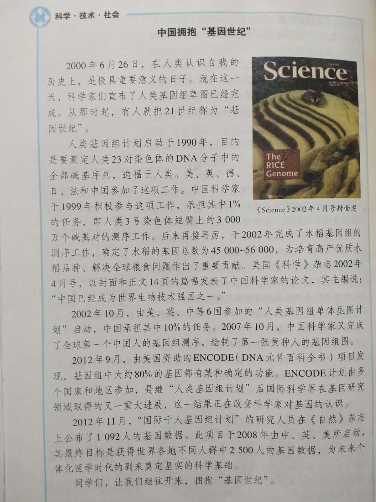
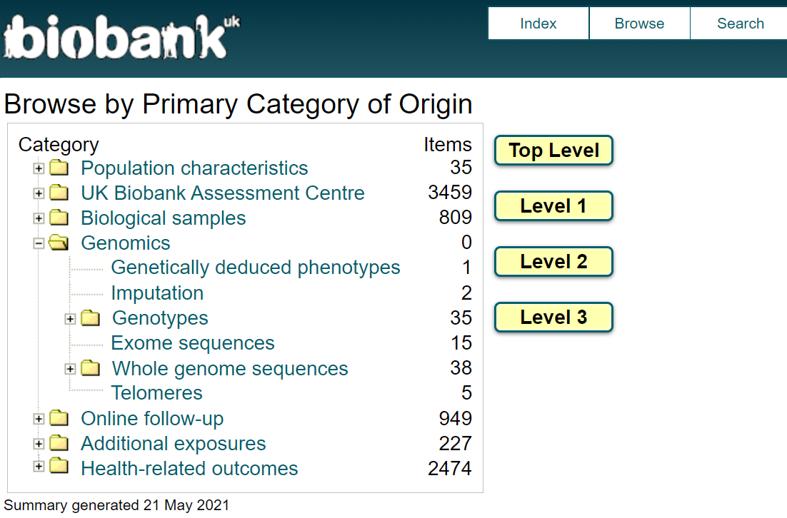
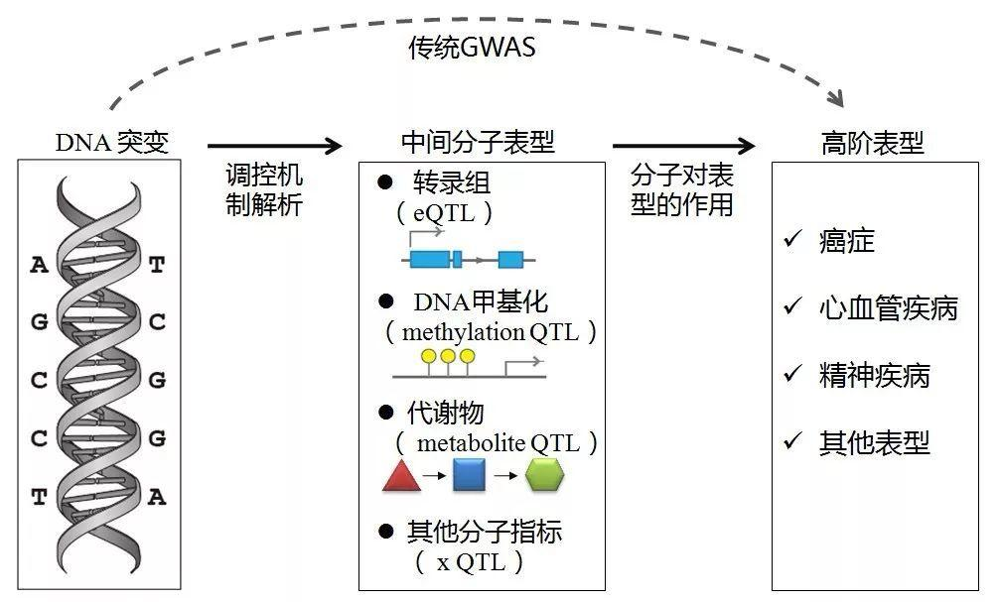
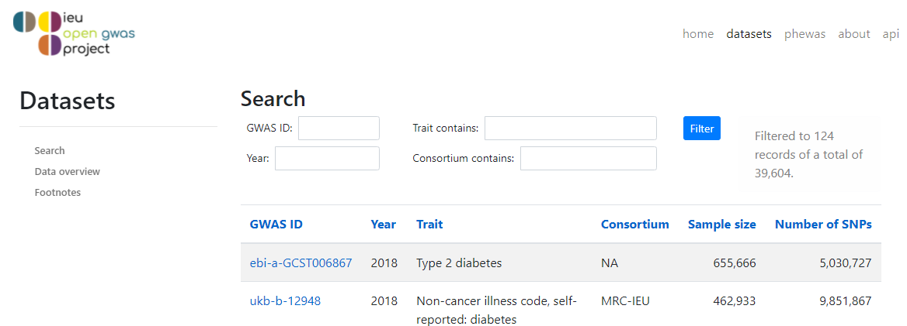
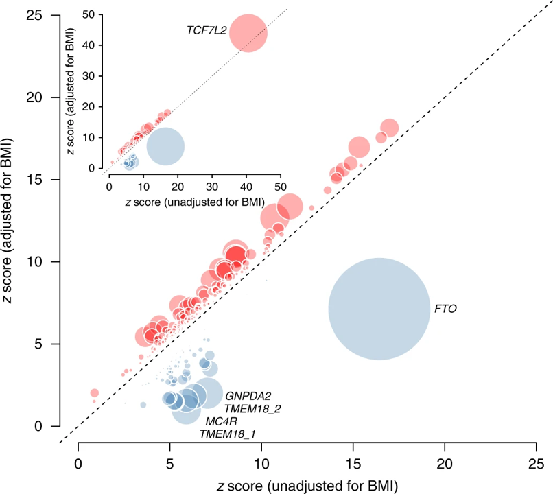
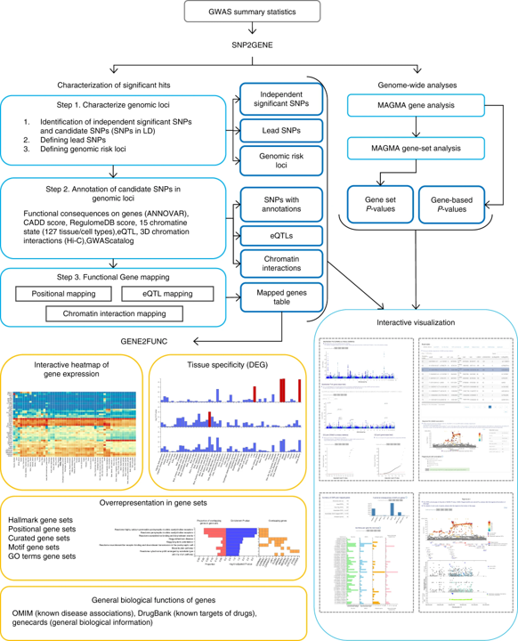

<br/>
<br/>

# #1. 下载和处理国际上公用公开的数据

> ### 这是初二生物学课本里面的一页。



## #1.1 HAPMAP3 genotype 数据, 一般作为 LD 计算的 reference panel

> 打开 <https://www.broadinstitute.org/medical-and-population-genetics/hapmap-3>， 
> 点击 How To Download This Release 下面的 A. SNP Genotype Data 段落的中间3个链接。
> 文件名字里面有 "b36"，现在一般都用 b37（比如 UK Biobank），甚至有的用 b38，
> 所以下载后解压后需要将那个 .map 文件先用 liftOver 转化为 b37 格式，然后用 PLINK 生成 bed/bim/fam 文件。
> 这个基因数据可供 LDSC 和 GSMR 等软件使用。
> 通过LD的计算来找到GWAS数据里面的independent top hits，计算量很大。如果不考虑 SNP之间的LD，只考虑距离，假设GWAS的第1，2，3 列分别是 SNP, CHR, POS，最后一列是P，可以用下面这个简单的代码来寻找GWAS数据里面每1MB区间的top SNP。
```
zcat ABC.gwas.gz | awk 'NR==1 || $NF<5e-8 {b=sprintf("%.0f",$3/1e6); print $1,$2,$3,$NF,b}' | \
	sort -k 2,2n -k 5,5n -k 4,4g | awk '{if (arr[$NF] !="Y") print $0; arr[$NF] ="Y"}' 
```
> 对应的R代码如下🔔🏮
```
dat <- read.table("GWAS.gz", header=T) %>% filter(P<=5e-08) %>% mutate(mb=ceiling(POS/1e+06))
dat %>% group_by(mb) %>% slice(which.min(P)) %>% ungroup() %>% select("SNP")
```
<br/>

## #1.2. 1000 genomes (千人基因组) genotype 数据， 一般作为 imputation 的 reference panel.

> 在[千人基因组官网](https://www.internationalgenome.org/data) 下载 Phase 3 对应的 VCF 链接，
> 有一个文件罗列了每一个样本的人群（pop）和人种 (super_pop)，以及性别，可以用PLINK --keep 选取特定人种的样本。
> 下载下来的数据，有将近一个亿的SNP，每个染色体都是单独的文件。后续跑 GWAS 或提取 PRS 的时候，也是每条染色体的数据分开来跑。
> PLINK的网站上也有“1000 genomes phase3” 数据。PLINK 不允许 SNP 名字有重复，可以用下面的命令来处理。
```
awk '{if(array[$2]=="Y") {i++; $2=$2".DUP"i}; print $0; array[$2]="Y"}' chr1.bim.COPY > chr1.bim 
```
<br/>


# #2. UKB 基因型和表型数据
阅读 Data access guide 文件，里面会提到如何下载用来下载UKB数据的小软件（比如ukbunpack和unkconv）。

申请得到批准后，从最上面的 Researcher log in 登录后获取。基因型数据我已下载到南科大的HPC上，表型数据见百度网盘上的 ukb50136.enc。
 [ukbiobank](ukbiobank.ac.uk) 官网，点击 data showcase --> Essential information --> Accessing UK Biobank data。具体的流程和代码，请见 scripts 文件夹下的 phe.sh, gen.sh 以及 phe.R 和 gen.R。
> 通过 ukbconv 提取很多列的时候，可以先写一个 MY.fields.txt 文件，列出想提取的变量和对应的 data-field，比如第一行是sex	31，第二行是 age 21022，等。然后用 ukbconv ukb50136.enc_ukb r -iMY.fields.id -oMY
> 对于表型数据的提取，有一个 [ukbtools R软件包](https://kenhanscombe.github.io/ukbtools/articles/explore-ukb-data.html)。 但不是太好用，并且很慢，可供参考。
> 用下面的代码将 icd.tab 文件整合为两列，便于读入R。
```
cat icd.tab | sed -e 's/\tNA//g' -e 's/\t/,/2g' | \
awk '{ if(NR==1) print "IID icd"; else if (NF==1) print $1 " NA"; else print $0"," }' > icd.2cols
```
<br/>


# #3. GWAS 运行和结果 “挖掘”



<br/>

## #3.1. 专人在服务器上运行
> 提取需要研究的表型数据和相关的covariates，比如 age, sex, PCs。
> 一般来说，quantitative的表型数据要 adjust for covariates 和转化成正态分布，这个可以在R里面用下面的命令来实现。
```
trait_res = residuals(lm(trait ~ age+sex+PC1+PC2, na.action=na.exclude)
trait_inv = qnorm((rank(trait_res,na.last="keep")-0.5) / length(na.omit(trait_res)))
```
> 对于疾病的binary 表型，只需要把需要 adjust 的covarites 和表型数据放在同一个表型数据文件里面，
> 然后在 GWAS里面的plink命令指明哪个是表型，哪些是 covariates。
> 目前GWAS 由专人负责运行，一般来说就是通过下面这样的PLINK命令来跑
```
for chr in {1..22}; do
  plink2 --memory 12000 --threads 16 --pfile chr$chr --extract ukb.chr$chr.good.snps --pheno cvd.EUR.pheno --no-psam-pheno --pheno-name XXX --1 --glm cols=+ax,+a1freq,+a1freqcc,+a1count,+a1countcc,+beta,+orbeta,+nobs hide-covar no-x-sex --covar pheno/ukb.cov --covar-name age,sex,PC1-PC10 --out chr$chr   
done
```
> 上述命令顺利跑完后，确认生成的文件没有问题后，可以把所有的染色体的数据串到一起，形成一个单一的 XXX.gwas.gz 文件。
<br/>

## #3.2. 公开的GWAS数据进行练手，或对比

> 最经典的，起源于美国NIH 的 [GWAS Catalog](https://www.ebi.ac.uk/gwas). 这个页面也罗列了一些大型GWAS数据联盟。
> 欧洲版本，不需要下载就能通过 TwoSampleMR 远程读入。他们提倡 使用 VCF 格式的GWAS文件。


> UKB GWAS 完整的分析结果，网上发布
> > - 美国哈佛大学：http://www.nealelab.is/uk-biobank 
> > - 英国爱丁堡大学：geneatlas: http://geneatlas.roslin.ed.ac.uk
> > - 哈佛大学的 CVD knowlege portal: https://hugeamp.org/

<br/><br/>


## #3.3. GWAS的管理、 QC、 注释
> 对每一个GWAS，首先进行以下“三点”检查：
```
1. 用 zcat GWAS.gz | awk '{print NF}' | sort -nu | wc -l 文件每一行的列数目是一样的。 一定要扣好第一粒纽扣🤲。可用 sed 's/^\t/NA\t/; s/\t\t/\tNA\t/g; s/\t\t/\tNA\t/g; s/\t$/\tNA/' 解决。
2. 如果文件不是按照CHR和POS排序🏮，pheweb 会报错，可用sort -k 1,1V -k 2,2n。 -V是为了把chrX和chrY排到最后，但是需要把第一行先写到新文件里。
3. GWAS数据本身的问题：
   (1). Allele 最好是大写，awk 和 R 都有 toupper()功能。
   (2). P值最好不要小于1e-312。 要不然，awk 会把其当成0，有一些软件（比如LDSC）也会报错，这个时候要么用Z值，要么人为将这些P值设为1e-300。
   (3). BETA|SE|P出现“三缺一” 的情况，可用： b = se * qnorm(p/2); se = abs(b/qnorm(p/2)); se = (CI_upper - CI_lower)/(1.96*2); p = 2*pnorm(-abs(b/se))
```

> 经过QC后的GWAS数据，可用 tabix -f -S 1 -s 1 -b 2 -e 2 GWAS.gz 生成索引文件。
> 本课题组建议用如下标准的column名称：🦁SNP CHRPOS CHR POS EA NEA EAF N BETA SE Z P🦁。
可用下面的 bash 代码实现：
```
Arr1=("SNP" "CHR" "POS" "EA" "NEA" "EAF" "N" "BETA" "SE" "P")
Arr2=("snp|rsid|variant_id" "chr|chrom|chromosome" "pos|bp|base_pair" "ea|alt|eff.allele|effect_allele|a1|allele1" "nea|ref|allele0|a2|other_allele|" "eaf|a1freq|effect_allele_freq" "n|Neff" "beta" "se|standard_error" "p|pval|p_bolt_lmm")
dat=XXX.gz
	head_row=`zcat $dat | head -1 | sed 's/\t/ /g'`; 
	snp=""; chr=""; pos=""; ea=""; nea=""; eaf=""; n=""; beta=""; se=""; p="" 
	for i in ${!Arr1[@]}; do
		eval ${Arr1[$i]}=`echo $head_row | tr ' ' '\n' | grep -Einw ${Arr2[$i]} | sed 's/:.*//'`
	done
	echo dat $dat, snp $SNP, ea $EA, nea $NEA, n $N, beta $BETA, p $P
```
对应的R代码如下：
```
replacement=c('SNP', 'CHR', 'POS','EA', 'NEA', 'EAF', 'N', 'BETA', 'SE', 'P') 
pattern=c('^snp$|^rsid$|variant_id', '^chr$|^chrom', '^bp$|^pos$|^position|^base_pair', '^ea$|^alt$|^a1$|^effect_allele$', '^nea$|^ref|^allele0$|^a2$|^other_allele', '^eaf$|a1freq|effect_allele_freq', '^n$|Neff', '^beta$|^effect$', '^se$|standard_error', '^p$|^pval$|^p_bolt_lmm')
names(dat) <- stringi::stri_replace_all_regex(toupper(names(dat)), pattern=toupper(pattern), replacement=replacement, vectorize_all=FALSE)

```
> 最后，可使用密西根大学开发的[Pheweb](https://github.com/statgen/pheweb) 实现可视化⚡⚡。日本版本[pheweb.jp](pheweb.jp)。中国版本的是本课题组建立的 [pheweb.cn](pheweb.cn)。
> Pheweb有一个强大的add_rsids.py 的功能，但是存在先天缺陷。根据该[聊天记录](https://github.com/statgen/pheweb/issues/217)，用户可以在安装pheweb 后找到 add_rsids.py 文件（find /home/ -name "add_rsid*" 或者 pip show --files pheweb），修改一行代码（第140行）。。
```
修改前：rsids = [rsid['rsid'] for rsid in rsid_group if cpra['ref'] == rsid['ref'] and are_match(cpra['alt'], rsid['alt'])]
修改后：rsids = [rsid['rsid'] for rsid in rsid_group if (cpra['ref'] == rsid['ref'] and are_match(cpra['alt'], rsid['alt'])) or (cpra['ref'] == rsid['alt'] and are_match(cpra['alt'], rsid['ref']))]
```
> 
用户也可以在得到[pheweb网站](https://resources.pheweb.org)上的 rsids-v154-hgXX.tsv.gz 文件（7亿多行）后，在本Github的 scripts文件夹下载本课题组修订的 add_rsid.py，dos2unix add_rsid2.py，然后运行如下示例命令。注意:--sep 后面有双引号。
```
python add_rsid.py -i test.tsv --sep "\t" --chr CHR --pos POS --ref NEA --alt EA -d files/dbsnp/rsids-v154-hg19.tsv.gz -o out.tsv
```
>  
<br/>


# #4. GWAS 及 post-GWAS分析

## #4.1 GWAS 功能（function）分析 

> 可先尝试傻瓜相机式的[FUMA](https://fuma.ctglab.nl/) 网上解读系统，见[参考文献](https://www.frontiersin.org/articles/10.3389/fgene.2020.00424/full)


>  

<br/>
<br/>

## #4.2 多基因风险评分PRS

> 相关的方法学，请参考经典版的 [PLINK0.9](http://zzz.bwh.harvard.edu/plink/profile.shtml) 和新版的 [PLINK1.9](https://www.cog-genomics.org/plink/1.9/score) 

<br/>
<br/>


## #4.3. 因果分析 Mendelian Randomization
> 如果有个体数据，可以用 [OneSampleMR包](https://cran.r-project.org/web/packages/OneSampleMR/index.html)。如果只有已发表的summary数据，就可以使用Bristol大学开发的[TwoSampleMR R包](https://mrcieu.github.io/TwoSampleMR/index.html)或剑桥大学团队开发的[MendelianRandomization R包](https://wellcomeopenresearch.org/articles/8-449)。
> 如果工具变量太多，存在LD问题，TwoSampleMR包有clump()的功能。西湖大学杨剑开发的[GSMR](https://cnsgenomics.com/software/gcta/#GSMR) 也可以应对LD问题。[GSMR](https://www.nature.com/articles/s41467-017-02317-2)的好处是在local电脑上运行，不好之处也是在local电脑上运行。 用户一般用 TwoSampleMR 在服务器上进行 clump，但是其过程和稳定性堪忧。 
<br/>
<br/>


# # 参考文献和网站

基因注释信息浏览器：
> - 非常经典的 dbSNP: https://www.ncbi.nlm.nih.gov/snp/   
> - 非常经典的 UCSC genome browser: https://www.genome.ucsc.edu/ 
> - 美国精准医学All of Us：https://www.researchallofus.org/ 和 https://databrowser.researchallofus.org/   
> - 密西根大学公卫学院 TopMed browser: https://bravo.sph.umich.edu/ 
> - 一天发了7篇 NATURE系列文章的Gnomad项目的 browser: https://gnomad.broadinstitute.org/ 
> - 带”Global“的 GlobalBiobankEngine：https://github.com/rivas-lab 

理论学习
> 进化对人类疾病的影响：
> > - Y 2021. Nature Review Genetics. [The influence of evolutionary history on human health and disease](https://www.nature.com/articles/s41576-020-00305-9)
> > - Y 2023. Science Bulletin. [Recent positive selection signatures reveal phenotypic evolution in the Han Chinese population](https://www.sciencedirect.com/science/article/pii/S2095927323005558)

GWAS-PRS-MR ”三驾马车“ 入门：
> GWAS:
> > - Y 2006. Nature Review Genetics. [A tutorial on statistical methods for population association studies](https://pubmed.ncbi.nlm.nih.gov/16983374/)
> > - Y 2014. Nature Protocols. [Quality control and conduct of genome-wide association meta-analyses](https://www.nature.com/articles/nprot.2014.071)
> > - Y 2021. Nature Reviews Methods Primers. [Genome-wide association studies](https://www.nature.com/articles/s43586-021-00056-9)
> > - [芬兰赫尔辛基大学 GWAS 课程](https://www.mv.helsinki.fi/home/mjxpirin/GWAS_course/)

> PRS:
> > - Y 2019. Lancet Respiratory Medicine. [Identification of risk loci and a polygenic risk score for lung cancer: a large-scale prospective cohort study in Chinese populations](pubmed.ncbi.nlm.nih.gov/31326317/)
> > - Y 2020. Nature Protocols. [Tutorial: a guide to performing polygenic risk score analyses](https://www.nature.com/articles/s41596-020-0353-1)
> > - Y 2022. EHJ. [A polygenic risk score improves risk stratification of coronary artery disease: a large-scale prospective Chinese cohort study](pubmed.ncbi.nlm.nih.gov/35195259/)
> > - Y 2023. Nature Medicine. [A multi-ancestry polygenic risk score improves risk prediction for coronary artery disease](https://www.nature.com/articles/s41591-023-02429-x)

> MR：
> > - Y 2012. 经典案例 Lancet. [Plasma HDL cholesterol and risk of myocardial infarction: a mendelian randomisation study](https://pubmed.ncbi.nlm.nih.gov/22607825/)
> > - Y 2017. 一篇解读我的PRIMe方法的文章 Ele Zeggini. [Statistical methods to detect pleiotropy in human complex traits](https://pubmed.ncbi.nlm.nih.gov/29093210/)
> > - Y 2021. 通过MR进行中介分析 [Mendelian randomisation for mediation analysis: current methods and challenges for implementation](https://pubmed.ncbi.nlm.nih.gov/33961203/)
> > - Y 2022. 入门必读 Nature Reviews Methods Primers. [Mendelian randomization](https://www.nature.com/articles/s43586-021-00092-5)
> > - Y 2023. 一篇非常简单的JAMA子刊 JAMA Psychiatry. [Association of Genetically Predicted Insomnia With Risk of Sepsis](https://jamanetwork.com/journals/jamapsychiatry/fullarticle/2807954)

<br/>


一些有用、有趣的实用工具：
> - [The R Graph Gallery](https://r-graph-gallery.com/index.html)
> - [Doing and reporting your first mediation analysis in R](https://towardsdatascience.com/doing-and-reporting-your-first-mediation-analysis-in-r-2fe423b92171)
> - [Add P-values and Significance Levels to ggplots](https://www.r-bloggers.com/2017/06/add-p-values-and-significance-levels-to-ggplots/)
> - [Top 100 R resources on COVID-19 Coronavirus](https://statsandr.com/blog/top-r-resources-on-covid-19-coronavirus/)
> - 以及 scitb, CanvasXpress, modelSummary, forplo，sankey diagram, CellChat, ComplexHeatmap，等等
<br/>
<br/>

## 代码中的数字揭秘：
> - X2Y: X到Y
> - Y4x: Y中数据中为(for)了X的部分，里面并没有X的数据，因此小写x。
> - dat0 原始数据，很大，不要多次读取； dat正常分析用的数据； dat1 临时数据，在loop里面使用，要不然在loop外面和里面都用dat，会出问题。