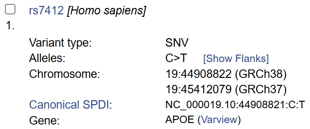

<br/>
<br/>

# #1. 下载和处理国际上公用公开的数据

> ### 这是初二生物学课本里面的一页。


## #1.1 HAPMAP3 genotype 数据, 一般作为 LD 计算的 reference panel

> 打开 <https://www.broadinstitute.org/medical-and-population-genetics/hapmap-3>， 
> 点击 How To Download This Release 下面的 A. SNP Genotype Data 段落的中间3个链接。
> 文件名字里面有 "b36"，现在一般都用 b37（比如 UK Biobank），甚至有的用 b38，
> 所以下载后解压后需要将那个 .map 文件先用 liftOver 转化为 b37 格式，然后用 PLINK 生成 bed/bim/fam 文件。
> 这个基因数据可供 LDSC 和 GSMR 等软件使用。
> 通过LD的计算来找到GWAS数据里面的independent top hits，计算量很大。如果不考虑 SNP之间的LD，只考虑距离，假设GWAS的第1，2，3 列分别是 SNP, CHR, POS，最后一列是P，可以用下面这个简单的代码来寻找GWAS数据里面每1MB区间的top SNP。
```
cat XXX.txt | awk 'NR==1 || $NF<=5e-8 {x=$3/1e+05; y=int(x); b=(x>y?y+1:y); print $1,$2,$3,b,$4}' | \
	sort -k 2,2n -k 4,4n -k 5,5g | awk '{block=$2"."$4; if (arr[block] !="Y") print $0; arr[block] ="Y"}'
```
> 对应的R代码如下🔔🏮
```
dat <- read.table("XXX.txt", header=T) %>% filter(P<=5e-08) %>% mutate(mb=ceiling(POS/1e+05))
dat1 <- dat %>% group_by(CHR, mb) %>% slice(which.min(P)) %>% ungroup()
```
<br/>

## #1.2. 千人基因组项目的genotype数据[VCF格式]，一般作为 imputation 的 reference panel.

> 在[千人基因组官网](https://www.internationalgenome.org/data) 下载 Phase 3 对应的 VCF [链接](https://ftp.1000genomes.ebi.ac.uk/vol1/ftp/release/20130502/)，GRCh37版本。
> 该数据是用[GATK](https://gatk.broadinstitute.org/hc/en-us)平台生成，用的reference genome 来自[GATK resource bundle](https://gatk.broadinstitute.org/hc/en-us/articles/360035890811-Resource-bundle)。
> 有一个文件罗列了每一个样本的人群（pop）和人种 (super_pop)，以及性别，可以用PLINK --keep 选取特定人种的样本。
> 下载下来的数据，有将近一个亿的SNP，每个染色体都是单独的文件。 后续运行 GWAS 或计算 PRS 的时候，也是每条染色体的数据分开来跑。
> PLINK的网站上也有“1000 genomes phase3” 数据。PLINK 不允许 SNP 名字有重复，可以用下面的命令来处理。
```
awk '{if(array[$2]=="Y") {i++; $2=$2".DUP"i}; print $0; array[$2]="Y"}' chr1.bim.COPY > chr1.bim 
```
<br/>

## #1.3. 使用 deepvariant 生成VCF数据.
> DeepVariant安装
>> 1. 远程链接服务器 172.18.42.37:33899
>> 2. VMware Workstation构建虚拟机，安装Linux Ubuntu 24.04.1 LTS。
>> 3. 根据[deepvariant](https://github.com/google/deepvariant?tab=readme-ov-file) 官方指南安装<b>Docker</b>版本。
>> 4. 注意事项：（i）VMware选择个人版本可免费使用；（ii）由于服务器不存在GPU，无需安装CUDA；（iii）拉取docker镜像时，如遇访问缓慢，选择切换镜像源为https://docker.1panel.live。

> DeepVariant运行
>> 1. 打开VMware，登陆Ubuntu系统上的终端进行操作。
>> 2. 具体步骤参考[deepvariant](https://github.com/google/deepvariant?tab=readme-ov-file) 上的 If you're using GPUs, or want to use Singularity instead, see <b>Quick Start</b> for more details。
>> 3. 注意事项：如果生成的文件会出现无权限访问，需要在终端修改权限
```
sudo shown -R administrator /home/administrator/quickstart-output
```


# #2. UKB 基因型和表型数据

基因型数据已下载到南科大的HPC上。
表型数据[更新信息](https://community.ukbiobank.ac.uk/hc/en-gb/articles/26088595922333-New-and-Updated-Data)<br>
点击[UKB RAP](https://dnanexus.gitbook.io/uk-biobank-rap)左边的 <b>accessing phenotype data</b>，下载TSV格式的表型数据。下载后，用下面代码将缺失数据替换为NA。
<br/>
<br/>


# #3. GWAS 运行和结果 “挖掘”


<br/>

## #3.1. 专人在服务器上运行
> 提取需要研究的表型数据和相关的covariates，比如 age, sex, PCs。
> 一般来说，quantitative的表型数据要 adjust for covariates 和转化成正态分布，这个可以在R里面用下面的命令来实现。
```
trait_res = residuals(lm(trait ~ age+sex+PC1+PC2, na.action=na.exclude)
trait_inv = qnorm((rank(trait_res,na.last="keep")-0.5) / length(na.omit(trait_res)))
```
> 对于疾病的binary 表型，只需要把需要 adjust 的covarites 和表型数据放在同一个表型数据文件里面，
> 然后在 GWAS里面的plink命令指明哪个是表型，哪些是 covariates。
> 目前GWAS 由专人负责运行，一般来说就是通过下面这样的PLINK命令来跑
```
for chr in {1..22}; do
  plink2 --memory 12000 --threads 16 --pfile chr$chr --extract ukb.chr$chr.good.snps --pheno cvd.EUR.pheno --no-psam-pheno --pheno-name XXX --1 --glm cols=+ax,+a1freq,+a1freqcc,+a1count,+a1countcc,+beta,+orbeta,+nobs hide-covar no-x-sex --covar pheno/ukb.cov --covar-name age,sex,PC1-PC10 --out chr$chr   
done
```
> 上述命令顺利跑完后，确认生成的文件没有问题后，可以把所有的染色体的数据串到一起，形成一个单一的 XXX.gwas.gz 文件。
<br/>


## #3.2. 公开的GWAS数据进行练手，或对比

> 最经典的，起源于美国NIH 的 [GWAS Catalog](https://www.ebi.ac.uk/gwas). 这个页面也罗列了一些大型GWAS数据联盟。
> 欧洲版本，不需要下载就能通过 TwoSampleMR 远程读入。

> UKB GWAS 完整的分析结果，网上发布
> > - 美国哈佛大学：http://www.nealelab.is/uk-biobank 
> > - 英国爱丁堡大学：geneatlas: http://geneatlas.roslin.ed.ac.uk
> > - 哈佛大学的 CVD knowlege portal: https://hugeamp.org/ 
<br/>


## #3.3. GWAS的管理、QC、注释
> 对每一个GWAS，首先进行以下“三点”检查：
```
1. 确保文件每一行的列数目是一样的。将连续空格中插入NA，扣好第一粒纽扣。
	zcat GWAS.gz | awk '{print NF}' | sort -nu | wc -l 
	sed 's/^\t/NA\t/; s/\t\t/\tNA\t/g; s/\t\t/\tNA\t/g; s/\t$/\tNA/'。
2. 按照CHR和POS排序，否则pheweb 会报错
	sort -k 1,1V -k 2,2n # -V是为了把chrX和chrY排到最后，但是需要把第一行先写到新文件里。
3. GWAS数据本身的问题：
   (1) Allele 最好是大写，awk 和 R 都有 toupper()功能。
   (2) P值最好不要小于1e-312，awk 会把其当成0，有一些软件（比如LDSC）也会报错，这个时候要么用Z值，要么人为将这些P值设为1e-300。
   (3) BETA|SE|P出现“三缺一” 的情况： b = se * qnorm(p/2); se = abs(b/qnorm(p/2)); se = (CI_upper - CI_lower)/(1.96*2); p = 2*pnorm(-abs(b/se))
```

> 对检查没问题的GWAS，可能继续进行以下“五步”加工：
```
1. liftOver 🚜
	dat=XYZ; head -1 $dat.txt > $dat.sorted; tail -n +2 $dat.txt | sort -k 1,1V -k 2,2n > $dat.sorted
	python ~/scripts/f/add_rsid.py -i $dat.sorted --sep "\t" --chr CHR --pos POS --ref NEA --alt EA -d ~/data/dbsnp/rsids-v154-hg19.tsv.gz -o $dat.tmp1
	cat $dat.tmp1 | awk 'NR >1 {print "chr"$1, $2 -1, $2, $9}' | sed 's/^chr23/chrX/' > $dat.tolift
	liftOver $dat.tolift /work/sph-huangj/files/hg19ToHg38.over.chain.gz $dat.lifted $dat.unmapped
	cut -f 3,4 $dat.lifted > $dat.pos_snp
	python ~/scripts/f/join_file.py -i "$dat.tmp1,TAB,8 $dat.pos_snp,TAB,1" -o $dat.tmp2
	cut -d " " -f 1-10 $dat.tmp2 | sed '1s/POS/POS.37/; 1s/NA/POS/' | gzip -f > clean/$dat.gz
2. 跟其他数据合并 ⛄
	python scripts/library/join_file.py -i "$dat,TAB,0 $dat.lifted.3col,TAB,2" -o $dat.NEW.tmp
	sed -i 's/  */\t/g' $dat.NEW.tmp; awk '$NF=="NA"' $dat.NEW.tmp | wc -l
	cut -f 1-10,12 $dat.NEW.tmp | sed '1 s/POS/POS.b38/' > $dat.NEW.txt
3. 添加 rsID 🧢
	用户也可以在pheweb网站下载 rsids-v154-hgXX.tsv.gz 文件（7亿多行）后，在本Github的 scripts文件夹下载本课题组修订的 add_rsid.py; dos2unix add_rsid.py，然后运行如下示例命令。
	python add_rsid.py -i test.tsv --sep "\t" --chr CHR --pos POS --ref NEA --alt EA -d data/dbsnp/rsids-v154-hg19.tsv.gz -o out.tsv
4. 瘦身 🏃‍
	zcat $dat.gz | awk '{if (NR!=1) {$5=sprintf("%.4f",$5); $6=sprintf("%.4f",$6)} print $0}' | bgzip > $dat.lean.gz
5. 索引🔍 
	tabix -f -S 1 -s 1 -b 2 -e 2 GWAS.gz
```

QC和加工后的数据，进行一些简单的check，比如看某个SNP是否是GRCH38.
>  


最后，不论是内源性还是外源性的GWAS数据，本课题组建议将所有列名标准化，bash代码如下。

注：🏮GCTA要求 SNP A1 A2 freq b se p N，顺序对了就行； PRS-CS严格要求5列SNP A1 A2 BETA(或OR) SE(或P) 
```
Arr1=("SNP" "CHR" "POS" "EA" "NEA" "EAF" "N" "BETA" "SE" "P")
Arr2=("snp|rsid|variant_id" "chr|chrom|chromosome" "pos|bp|base_pair" "ea|alt|eff.allele|effect_allele|a1|allele1" "nea|ref|allele0|a2|other_allele|" "eaf|a1freq|effect_allele_freq" "n|Neff" "beta" "se|standard_error" "p|pval|p_bolt_lmm")
dat=XYZ.gz
	head_row=`zcat $dat | head -1 | sed 's/\t/ /g'`; 
	snp=""; chr=""; pos=""; ea=""; nea=""; eaf=""; n=""; beta=""; se=""; p="" 
	for i in ${!Arr1[@]}; do; eval ${Arr1[$i]}=`echo $head_row | tr ' ' '\n' | grep -Einw ${Arr2[$i]} | sed 's/:.*//'`; done
	echo dat $dat, snp $SNP, ea $EA, nea $NEA, n $N, beta $BETA, p $P
```
对应的R代码如下：
```
replacement=c('SNP', 'CHR', 'POS','EA', 'NEA', 'EAF', 'N', 'BETA', 'SE', 'P') 
pattern=c('^snp$|^rsid$|variant_id', '^chr$|^chrom', '^bp$|^pos$|^position|^base_pair', '^ea$|^alt$|^a1$|^effect_allele$', '^nea$|^ref|^allele0$|^a2$|^other_allele', '^eaf$|a1freq|effect_allele_freq', '^n$|Neff', '^beta$|^effect$', '^se$|standard_error', '^p$|^pval$|^p_bolt_lmm')
names(dat) <- stringi::stri_replace_all_regex(toupper(names(dat)), pattern=toupper(pattern), replacement=replacement, vectorize_all=FALSE)
```

> 📺可视化，可使用密西根大学开发的[Pheweb](https://github.com/statgen/pheweb) 。日本版本[pheweb.jp](pheweb.jp)，中国版本的是本课题组建立的 [pheweb.cn](pheweb.cn)。
> Pheweb有一个强大的add_rsids.py 的功能，但是存在先天缺陷。根据该[聊天记录](https://github.com/statgen/pheweb/issues/217)，用户可以在安装pheweb 后找到 add_rsids.py 文件（find /home/ -name "add_rsid*" 或者 pip show --files pheweb），修改一行代码（第140行）。。
```
修改前：rsids = [rsid['rsid'] for rsid in rsid_group if cpra['ref'] == rsid['ref'] and are_match(cpra['alt'], rsid['alt'])]
修改后：rsids = [rsid['rsid'] for rsid in rsid_group if (cpra['ref'] == rsid['ref'] and are_match(cpra['alt'], rsid['alt'])) or (cpra['ref'] == rsid['alt'] and are_match(cpra['alt'], rsid['ref']))]
```
> 
> 密西根大学还开发了[locuszoom](http://locuszoom.org/) 实现基因组局部地区的可视化🔍。 
<br/>


# #4. Post-GWAS分析


## #4.1 单个 GWAS 的深度功能（function）分析 

> 可先尝试傻瓜相机式的[FUMA](https://fuma.ctglab.nl/) 网上解读系统，见[参考文献](https://www.frontiersin.org/articles/10.3389/fgene.2020.00424/full)
>  
<br/>


## #4.2 基于单个GWAS的多基因风险评分PRS

> 相关的方法学，请参考经典版的 [PLINK0.9](http://zzz.bwh.harvard.edu/plink/profile.shtml) 和新版的 [PLINK1.9](https://www.cog-genomics.org/plink/1.9/score) 
<br/>


## #4.3. 两个或多个GWAS之间的 genetic correlation 分析
> 一般用[LDSC](https://github.com/bulik/ldsc)软件。
> 
<br/> 

## #4.4. 两个或多个GWAS之间的 Mendelian Randomization 分析
> 如果有个体数据，可以用 [OneSampleMR包](https://cran.r-project.org/web/packages/OneSampleMR/index.html)。如果只有已发表的summary数据，就可以使用Bristol大学开发的[TwoSampleMR R包](https://mrcieu.github.io/TwoSampleMR/index.html)或剑桥大学团队开发的[MendelianRandomization R包](https://wellcomeopenresearch.org/articles/8-449)。
> 工具变量，一般需要去掉 F_stats <10 或者位于 <b>[MHC区间]</b> 【chr6:28477897-33448354 [(GRCh37)](https://www.ncbi.nlm.nih.gov/grc/human/regions/MHC?asm=GRCh37), chr6:28510120-33480577 [(GRCh38)](https://www.ncbi.nlm.nih.gov/grc/human/regions/MHC)】 的SNP。
> <b>密西根大学</b>开发的 [imputation server](https://imputationserver.sph.umich.edu) 用的是： 从rs57232568 【29000554 (版本37), 29032777 (版本38)】 到 rs116206961【33999992 (版本37), 34032215 (版本38)】
> 使用别人发表了的现成的R包，看似简单，但是每一步都需要 check 和 check。实际当中遇到的问题如下🏮：
```
> 1. 用 allele.qc，协调两组数据的 BETA和EAF，但是输出文件依然是原来的EA和 NEA。
> 2. 用 fread和fwrite 比 read.table 和 write.table 更快，但fwrite默认输出带quote。
> 3. EAF如果是0，fwrite 会将其视为NA，输出后TXT就是一个空格，导致数据少了一列。
> 4. gcta –cojo-slct 生成的 .ldr.cojo 文件最后多出一列TAB。
> 5. 添加代码，处理两个输入GWAS，其中一个或者两个都不存在 EAF 和 N 的问题。
> 6. 连着用几个 %>%，缩减代码，最后实际上跑偏了、失控了。
> 7. 用 group() 之后，如果后面没有跟上 ungroup()，后面会出问题。
> 8. 用 plink，.bim 文件中的染色体可以用 X表示。但是 gcta 必须用 23。
> 9. 注意HLA的GRCh37或GRCh37的确切 chr:start-end。
>10. 最后可能发现软件跑出来的结果有重大问题，不“鲁棒” https://github.com/ZhaotongL/cisMRcML/issues/6
```
<br/>
<br/>


# # 参考文献和网站

基因注释信息🔍
```
> - 非常经典的 dbSNP: https://www.ncbi.nlm.nih.gov/snp/   
> - 非常经典的 UCSC genome browser: https://www.genome.ucsc.edu/ 
> - 美国精准医学All of Us：https://www.researchallofus.org/ 和 https://databrowser.researchallofus.org/   
> - 密西根大学公卫学院 TopMed browser: https://bravo.sph.umich.edu/ 
> - 一天发了7篇 NATURE系列文章的Gnomad项目的 browser: https://gnomad.broadinstitute.org/ 
```

GWAS-PRS-MR ”三驾马车“ 入门指南🐎：
```
> GWAS入门： 2021. Nature Reviews Methods Primers. [Genome-wide association studies](https://www.nature.com/articles/s43586-021-00056-9)
	[芬兰赫尔辛基大学 GWAS 课程](https://www.mv.helsinki.fi/home/mjxpirin/GWAS_course/)
	🏮中文版 [gwaslab.org](https://gwaslab.org)
> PRS入门. Nature Protocols. [Tutorial: a guide to performing polygenic risk score analyses](https://www.nature.com/articles/s41596-020-0353-1)
> MR入门： 2022. Nature Reviews Methods Primers. [Mendelian randomization](https://www.nature.com/articles/s43586-021-00092-5)
```

R 🛵
```
> packageVersion("XY"); remove.packages("XY"); update.packages(ask=FALSE, checkBuilt=TRUE)
> install.packages("XY", repos="http://cran.rstudio.com/", dependencies=TRUE)
> 本机: Windows底部 “搜索” 写 env，在“环境变量”里 将 R_LIBS_USER 设为 D:\software_win\R_lib
> HPC: source /share/apps/anaconda3/2020.7/bin/activate /work/sph-huangj/.conda/envs/R4.4.2
       export R_LIBS=/work/sph-huangj/.conda/envs/R4.4.2/lib/R/library:/work/sph-huangj/.conda/envs/R/lib/R/library:$R_LIBS
> 画图集锦: https://r-graph-gallery.com/index.html
> R新冠地图: https://statsandr.com/blog/top-r-resources-on-covid-19-coronavirus/
> 供复现代码： https://globalenvhealth.org/code-data-download/
```

Linux🤖
```
> 安装Linux: 用管理员权限打开cmd, 运行 wsl --install，或者 wsl --import。 遇到 press any key to continue，运行 netsh winsock reset
  在 ~/.bashrc:  export PATH="XYZ:$PATH"; export R_LIBS="/mnt/d/software_lin/R_lib" 
  apt install bcftools samtools tabix; pip install XXX; conda install
> 批量删除文件: ls | grep -vE "\.log$|\.dat$" | xargs rm -f
> 在HPC上后台提交： nohup ./assoc.sum.sh & 之后 ps aux | grep assoc.sum.sh 之后 kill
> 后台多线程下载: apt-get install aria2;  sudo screen -S jack -d -m aria2c -x 4 -i files.txt; 然后查看 sudo screen -r jack
> 基于某一列生成多个文件: awk '{cnt=int(NR/100); print $0 > "download"cnt".sh"}'
> 将duplicate改名唯一: awk '{if(array[$2]=="Y") {i++; $2=$2".DUP"i}; print $0; array[$2]="Y"}' chr20.bim.COPY 
  或者: plink2 --set-all-var-ids to generate new IDs based on position and alleles, to avoid duplicate IDs
> 将文件每列读入变量中: cut -f 1,4 $file | while IFS=$'\t' read -r pheno_code file_url; do file_name=$(basename $file_url); file_ext=${file_name##*.}
> 给bed文件加索引: tabix -pbed; tabix -s1 -b2 -e2; bedtools intersect -a -b -wa
```

Interactive Python 🏂 
```
安装 pip install keplergl pandas jupyter
运行 jupyter notebook 
可视 http://localhost:8889/tree
民航地图示例：https://github.com/wybert/minhang
```
<br/>
<br/>