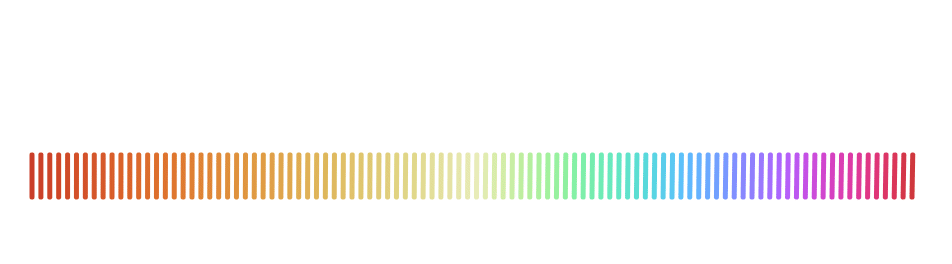

# 🚩**GWAS** 🛞 **MR** 🛞 **P[ro]RS** 🛞 🧬 

  

## 0. Data resources

- [Operating system and WSL notes](./pages/note_OS.md)
- [R setup and package installation notes](./pages/note_R.md)
- [VCF-to-protein and AlphaFold-related notes](./pages/vcf2prot.md)
- [HapMap3 genotype data](https://www.broadinstitute.org/medical-and-population-genetics/hapmap-3): a compact SNP set often used as an LD reference panel.
- [1000 Genomes Project](https://www.internationalgenome.org/data): a widely used reference resource for imputation, LD calculation, and ancestry-aware analyses.
- [UK Biobank Research Analysis Platform](https://dnanexus.gitbook.io/uk-biobank-rap): the recommended cloud environment for large-scale UK Biobank analyses.

 

  

## 1. GWAS 全基因组关联研究

**Start here**

- [GWAS Catalog](https://www.ebi.ac.uk/gwas): useful for finding the GWAS evidence behind many traits.
- [GWAS summary statistics QC checklist](./pages/GWAS.post.md)
- [Genome-build liftOver for GWAS/COJO tables and VCF files](./pages/liftOver.md)
- [GWAS signal annotation resources](./pages/note_annotate.md)

**Public resources and visualization**

- [GWAS Catalog](https://www.ebi.ac.uk/gwas): the classic public catalog of published GWAS associations.
- [PheWeb](https://pheweb.org/): browser for large-scale GWAS/PheWAS results. Examples include [CKB PheWeb](https://pheweb.ckbiobank.org/), [TPMI PheWeb](https://pheweb.ibms.sinica.edu.tw/), and [BBJ PheWeb](https://pheweb.jp/).
- [PheWeb2](https://github.com/GaglianoTaliun-Lab/PheWeb2): a newer implementation for interactive genetic association result browsing.
- [LocusZoom](http://locuszoom.org/): regional association visualization around GWAS loci.

**Recommended reading** 🚩☭

- Chinese tutorial resource: [gwaslab.org](https://gwaslab.org/)
- **2021**. *Nature Reviews Methods Primers*. [Genome-wide association studies](https://www.nature.com/articles/s43586-021-00056-9)
- **2026**. *CBio*. [Transformer-based InsightGWAS improves GERD genetic discovery via pretraining on GWAS for major depressive disorder](https://www.nature.com/articles/s42003-025-09177-3)
- **2026**. *NG*. [Empirically determined baseline masking strategies and other considerations for gene-level burden tests](https://www.nature.com/articles/s41588-026-02597-9)
- **2026**. *NHB*. [Genome-wide meta-analysis of quantitatively measured generalized anxiety symptoms in individuals of European ancestry](https://www.nature.com/articles/s41562-026-02476-7).
- **2026**. *NRG*. Yiming Bian & <b>Joshua M. Akey</b>. [Genetic analysis of imaging-derived phenotypes](https://www.nature.com/articles/s41576-026-00989-5)

 

  

## 2. MR 孟德尔随机化

**Start here**

- [MR practical notes and common pitfalls](./pages/note_MR.md)

**Common tools**

- Individual-level data: [OneSampleMR](https://cran.r-project.org/web/packages/OneSampleMR/index.html)
- Summary-level data: [TwoSampleMR](https://mrcieu.github.io/TwoSampleMR/index.html) and [MendelianRandomization](https://wellcomeopenresearch.org/articles/8-449)
- MR mediation: `mrMed`/`mrMedR`-style workflows can be considered when the scientific question is exposure → mediator → outcome.

**Recommended reading**

- **2022**. Nature Reviews Methods Primers. [Mendelian randomization](https://www.nature.com/articles/s43586-021-00092-5)
- **2026**. EHJ. [GLP-1R agonists and heart failure: novel beneficial effects suggested by Mendelian randomization](https://academic.oup.com/eurheartj/article-abstract/47/19/2308/8444645?redirectedFrom=fulltext)

 

  

## 3. PRS | PGS | ProtRS 风险预测

**Start here**

- [PRS Catalog](https://www.pgscatalog.org/): public repository of published polygenic score scoring files.
- **2020**. NP. <b>Shing Wan Choi</b> & Paul F. O’Reilly. [Tutorial: a guide to performing polygenic risk score analyses](https://www.nature.com/articles/s41596-020-0353-1)

**Recommended reading** 🚩☭

- **2024**. NG. <b>谷歌REGLE团队</b>. [Unsupervised representation learning on high-dimensional clinical data improves genomic discovery and prediction](https://www.nature.com/articles/s41588-024-01831-6)
- **2026**. NP. <b>Pradeep Ratarajan</b> [Development and Validation of a Clinical Polygenic Risk Report in U.S.-Based Health Systems for 8 Cardiovascular Conditions](https://www.jacc.org/doi/10.1016/j.jacc.2026.03.035)
- **2026**. NC. [Integrating common and rare variants improves polygenic risk prediction across diverse populations](https://www.nature.com/articles/s41467-026-72185-2)
- **2026**. MedRxiv. [Large-scale evaluation of proteomic and polygenic risk scores reveals complementary contributions to incident disease prediction](https://pubmed.ncbi.nlm.nih.gov/40672481/)
- **2026**. NM. [Circulating metabolites, genetics and lifestyle factors in relation to future risk of type 2 diabetes](https://www.nature.com/articles/s41591-025-04105-8)
- **2026**. NG. [Genetic association and machine learning improve the prediction of type 1 diabetes risk](https://www.nature.com/articles/s41588-026-02578-y)

 

  

## 4. 唐诗宋词

🏛🌄 
- **2025-01** · *Nature* · [Site-saturation mutagenesis of 500 human protein domains](https://www.nature.com/articles/s41586-024-08370-4)
- **2025-07** · *Nature* · [The role of metabolism in shaping enzyme structures over 400 million years](https://www.nature.com/articles/s41586-025-09205-6)
- **2026-04** · *Nature* · [Ancient DNA reveals pervasive directional selection across West Eurasia](https://www.nature.com/articles/s41586-026-10358-1)
- **2026-04** · *Nature* · [EBV strain interacts with host HLA to drive nasopharyngeal carcinoma risk](https://www.nature.com/articles/s41586-026-10416-8)
- **2026-05** · *Nature* · [Expanding the human proteome with microproteins and peptideins](https://www.nature.com/articles/s41586-026-10459-x)

📖🍵 
- **2026-05** · *NG* · [Genome-wide associations of structural variants with human traits through imputation from long-read assemblies](https://www.nature.com/articles/s41588-026-02612-z)
- **2026-05** · *NG* · [Exome-wide association study of blood lipids in 1,158,017 individuals from diverse populations](https://www.nature.com/articles/s41588-026-02613-y)
- **2026-06** · *NM* · [Automated reanalysis of genomic data for rare disease diagnostics at scale](https://www.nature.com/articles/s41591-026-04477-5)

🧱⛏️ 下列文章由 ukb/0demo.sh[R] 代码部分复现：
- 01 **2025-02** · *NM* · [Integrating the environmental and genetic architectures of aging and mortality](https://www.nature.com/articles/s41591-024-03483-9)
- 02 **2025-08** · *NC* · [Modeling the genomic architecture of adiposity and anthropometrics across the lifespan](https://www.nature.com/articles/s41467-025-62730-w)
- 03 **2025-09** · *NC* · [Shared genetic architecture contributes to risk of major cardiovascular diseases](https://www.nature.com/articles/s41467-025-62419-0)
- 04 **2026-05** · *Nature* · [Sleep chart of biological ageing clocks in middle and late life](https://www.nature.com/articles/s41586-026-10524-5)
- 05 **2026-05** · *NMeth* · [Decoding sequence determinants of gene expression in diverse cellular and disease states](https://www.nature.com/articles/s41592-026-03102-0)
- 06 **2026-05** · *Nature* · [Distinct genetic architecture in the tails of complex traits](https://www.nature.com/articles/s41586-026-10516-5)
- 07 **2026-06** · *NG* · [Pleiotropic shared heritability quantifies the shared genetic variance of common diseases](https://www.nature.com/articles/s41588-026-02607-w)
- 08 **2026-06** · *NM* · [Plasma proteomic signatures of cellular aging predict human disease](https://www.nature.com/articles/s41591-026-04446-y) 
- 09 **2026-06** · *NM* · [Biological aging and generational shifts in early-onset cancer risk](https://www.nature.com/articles/s41591-026-04448-w)
- 10 **2026-06** · *Adv Sci* · [Harnessing large-scale multi-omics data for risk prediction and deep phenotyping of valvular heart diseases in the general population](https://advanced.onlinelibrary.wiley.com/doi/10.1002/advs.76345)

🐜🐘 小文章，大分析；大文章，小分析
- **8个图，8分杂志：2026-04** · *Journal of Headache and Pain Article* · [Plasma proteomics identifies proteins and pathways associated with incident migraine in 50,668 adults] (https://link.springer.com/article/10.1186/s10194-026-02345-8)
- **cis-MR🚀45分：2026-04** 葛军波院士 *European Heart Journal* · [GLP-1R agonists and heart failure: novel beneficial effects suggested by Mendelian randomization]()

 

  

---

<table width="100%">
  <tr>
    <td width="50%" valign="top">
<pre>
.
└── pages/
    ├── GWAS.post.md
    ├── liftOver.md
    ├── note_annotate.md
    ├── note_MR.md
    ├── note_OS.md
    ├── note_R.md
    └── vcf2prot.md
</pre>
    </td>
    <td width="50%" valign="top">
<pre>
.
└── pubs/
    ├── blockzoom: ui.R, server.R
	├── ems120: ems120.R, ems120.py
	├── gu✳: gu.sh, ibdmix.sh
	├── le8✳: le8.R, proxy.f.R
    ├── minhang: streamlite_app.py
    ├── pageant: GUI.py, main.py
    └── yy✳: yy.R
</pre>
    </td>
  </tr>
  <tr>
    <td width="50%" valign="bottom" align="center">
      
    </td>
    <td width="50%" valign="bottom" align="center">
      
    </td>
  </tr>
</table>

🌅 🌙 🦟 🐜 ▸ 🛫 🧬 🅱️ H 💊