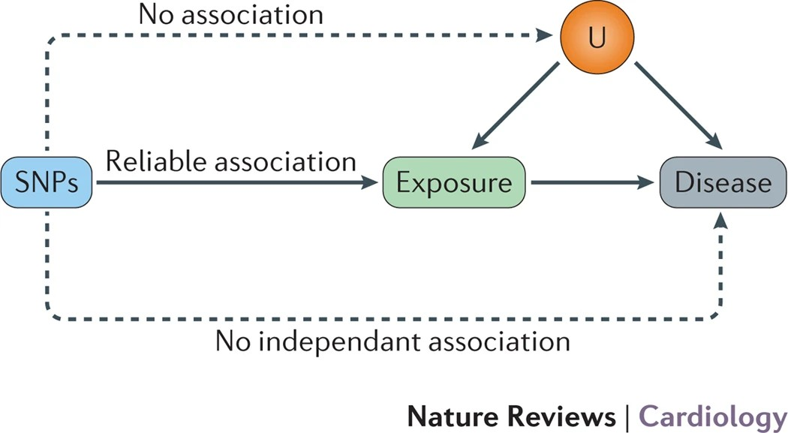
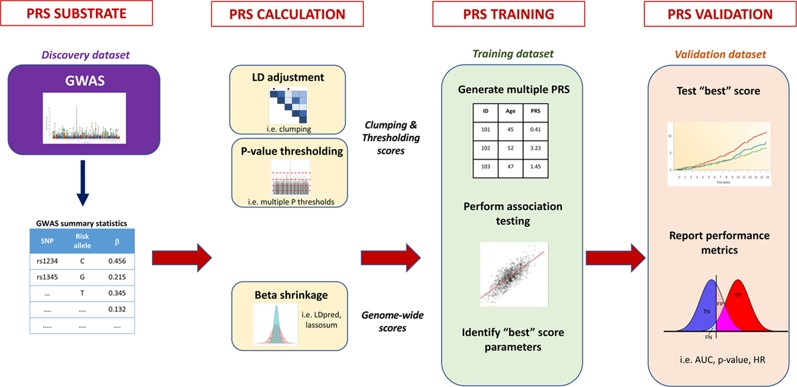

# 🧬 **GWAS**, **MR**, **Polygenic/Protein RS**, and **AI**.

---

## 0. Data resources

- [HapMap3 genotype data](https://www.broadinstitute.org/medical-and-population-genetics/hapmap-3): a compact SNP set often used as an LD reference panel.
- [1000 Genomes Project](https://www.internationalgenome.org/data): a widely used reference resource for imputation, LD calculation, and ancestry-aware analyses.
- [UK Biobank Research Analysis Platform](https://dnanexus.gitbook.io/uk-biobank-rap): the recommended cloud environment for large-scale UK Biobank analyses.

---

<br><br>
## 1. GWAS全基因组关联研究


Genome-wide association studies identify statistical associations between genetic variants and traits. In practice, the most important first step is not plotting, but making sure the summary statistics are clean, consistently named, genome-build-aware, and correctly indexed.

**Start here**

- [GWAS summary statistics QC checklist](./pages/GWAS.post.md)
- [Genome-build liftOver for GWAS/COJO tables and VCF files](./pages/liftOver.md)
- [GWAS signal annotation resources](./pages/note_annotate.md)

**Public resources and visualization**

- [GWAS Catalog](https://www.ebi.ac.uk/gwas): the classic public catalog of published GWAS associations.
- [PheWeb](https://pheweb.org/): browser for large-scale GWAS/PheWAS results. Examples include [CKB PheWeb](https://pheweb.ckbiobank.org/), [TPMI PheWeb](https://pheweb.ibms.sinica.edu.tw/), and [BBJ PheWeb](https://pheweb.jp/).
- [PheWeb2](https://github.com/GaglianoTaliun-Lab/PheWeb2): a newer implementation for interactive genetic association result browsing.
- [LocusZoom](http://locuszoom.org/): regional association visualization around GWAS loci.

**Recommended reading**

- Tam et al. *Nature Reviews Methods Primers* 2021. [Genome-wide association studies](https://www.nature.com/articles/s43586-021-00056-9)
- Chinese tutorial resource: [gwaslab.org](https://gwaslab.org/)

---

<br><br>
## 2. MR孟德尔随机化



Mendelian randomization uses genetic variants as instrumental variables to estimate whether an exposure may have a causal effect on an outcome. The core workflow is simple, but the details matter: instrument strength, allele harmonization, LD clumping, sample overlap, MHC/HLA regions, and pleiotropy checks can all change the interpretation.

**Start here**

- [MR practical notes and common pitfalls](./pages/note_MR.md)

**Common tools**

- Individual-level data: [OneSampleMR](https://cran.r-project.org/web/packages/OneSampleMR/index.html)
- Summary-level data: [TwoSampleMR](https://mrcieu.github.io/TwoSampleMR/index.html) and [MendelianRandomization](https://wellcomeopenresearch.org/articles/8-449)
- MR mediation: `mrMed`/`mrMedR`-style workflows can be considered when the scientific question is exposure → mediator → outcome.

**Recommended reading**

- Sanderson et al. *Nature Reviews Methods Primers* 2022. [Mendelian randomization](https://www.nature.com/articles/s43586-021-00092-5)

---

<br><br>
## 3. PRS/ProtRS组学风险预测



Polygenic risk scores summarize many genetic effects into an individual-level score. A published PRS usually has two layers: a **reference scoring file** containing SNPs and weights, and an **individual-level score** calculated by applying those weights to genotype data. The same idea can be extended to protein-based risk scores, where protein abundances or genetically predicted proteins are used for risk prediction.

**Start here**

- [PRS Catalog](https://www.pgscatalog.org/): public repository of published polygenic score scoring files.
- [GWAS Catalog](https://www.ebi.ac.uk/gwas): useful for finding the GWAS evidence behind many traits.

**Key distinction**

```text
Reference scoring file: SNP / effect allele / weight
Individual PRS:         sum of allele dosage × weight for each person
```

**Recommended reading**

- Choi et al. *Nature Protocols* 2020. [Tutorial: a guide to performing polygenic risk score analyses](https://www.nature.com/articles/s41596-020-0353-1)

---

<br><br>
## 4. AI人工智能

[](https://www.youtube.com/playlist?list=PLZHQObOWTQDNU6R1_67000Dx_ZCJB-3pi)

AI tools are useful for text classification, phenotype extraction, local model deployment, and code-assisted analysis. For biomedical data, the practical questions are usually: how to install the environment, how to run models locally, and how to connect model outputs with downstream statistical analysis.

**Start here**

- [Windows/WSL, Python, PyTorch and local Transformer setup](./pages/note_OS.md)
- [VCF-to-protein and AlphaFold-related notes](./pages/vcf2prot.md)

---

<br><br>
## 5. 基础ℹ分享

- [R setup and package installation notes](./pages/note_R.md)
- [Operating system and WSL notes](./pages/note_OS.md)

---

```text
.
├── README.md
└── pages/
    ├── GWAS.post.md
    ├── liftOver.md
    ├── note_annotate.md
    ├── note_MR.md
    ├── note_OS.md
    ├── note_R.md
    └── vcf2prot.md
```
