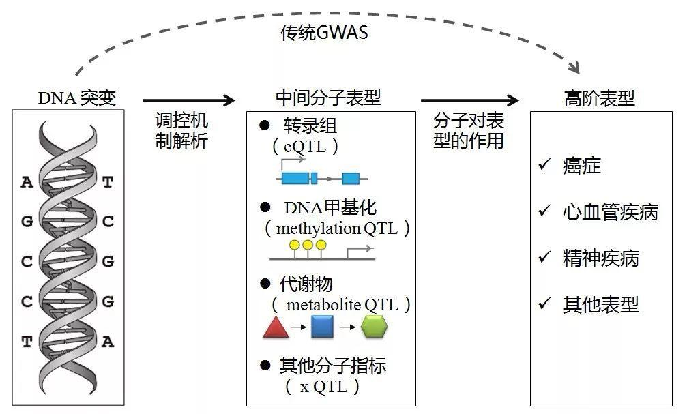
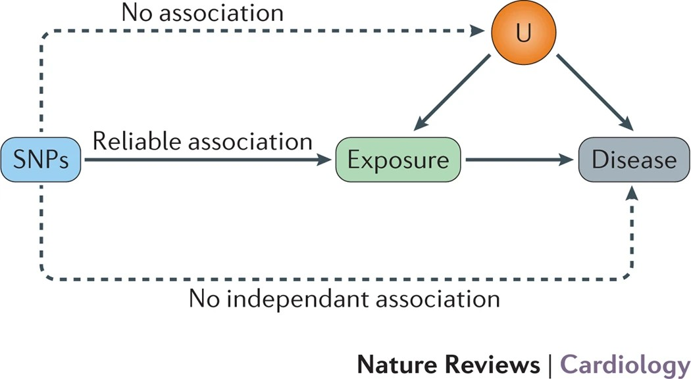
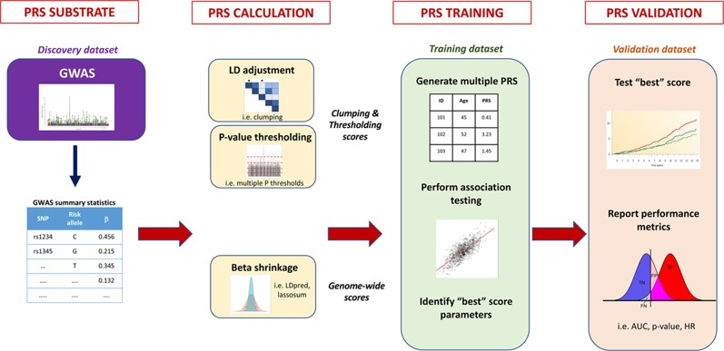

# 🚩**GWAS** 🛞 **MR** 🛞 **P[ro]RS** 🛞 🧬 

  

## 0. Data resources

- [Operating system and WSL notes](./pages/note_OS.md)
- [R setup and package installation notes](./pages/note_R.md)
- [VCF-to-protein and AlphaFold-related notes](./pages/vcf2prot.md)
- [HapMap3 genotype data](https://www.broadinstitute.org/medical-and-population-genetics/hapmap-3): a compact SNP set often used as an LD reference panel.
- [1000 Genomes Project](https://www.internationalgenome.org/data): a widely used reference resource for imputation, LD calculation, and ancestry-aware analyses.
- [UK Biobank Research Analysis Platform](https://dnanexus.gitbook.io/uk-biobank-rap): the recommended cloud environment for large-scale UK Biobank analyses.

 

  

## 1. GWAS 全基因组关联研究

**Start here**

- [GWAS Catalog](https://www.ebi.ac.uk/gwas): useful for finding the GWAS evidence behind many traits.
- [GWAS summary statistics QC checklist](./pages/GWAS.post.md)
- [Genome-build liftOver for GWAS/COJO tables and VCF files](./pages/liftOver.md)
- [GWAS signal annotation resources](./pages/note_annotate.md)

**Public resources and visualization**

- [GWAS Catalog](https://www.ebi.ac.uk/gwas): the classic public catalog of published GWAS associations.
- [PheWeb](https://pheweb.org/): browser for large-scale GWAS/PheWAS results. Examples include [CKB PheWeb](https://pheweb.ckbiobank.org/), [TPMI PheWeb](https://pheweb.ibms.sinica.edu.tw/), and [BBJ PheWeb](https://pheweb.jp/).
- [PheWeb2](https://github.com/GaglianoTaliun-Lab/PheWeb2): a newer implementation for interactive genetic association result browsing.
- [LocusZoom](http://locuszoom.org/): regional association visualization around GWAS loci.

**Recommended reading** 🚩☭

- Chinese tutorial resource: [gwaslab.org](https://gwaslab.org/)
- **2027**. *❓*. Large-scale meta-analysis of over one million individuals reveals the geneticarchitecture of 127 complex traits in East Asian populations
- **2026**. *CBio*. [Transformer-based InsightGWAS improves GERD genetic discovery via pretraining on GWAS for major depressive disorder](https://www.nature.com/articles/s42003-025-09177-3)
- **2026**. *NG*. [Empirically determined baseline masking strategies and other considerations for gene-level burden tests](https://www.nature.com/articles/s41588-026-02597-9)
- **2026**. *NHB*. [Genome-wide meta-analysis of quantitatively measured generalized anxiety symptoms in individuals of European ancestry](https://www.nature.com/articles/s41562-026-02476-7).
- **2026**. *NRG*. Yiming Bian & <b>Joshua M. Akey</b>. [Genetic analysis of imaging-derived phenotypes](https://www.nature.com/articles/s41576-026-00989-5)
- **2021**. *Nature Reviews Methods Primers*. [Genome-wide association studies](https://www.nature.com/articles/s43586-021-00056-9)

 

  

## 2. MR 孟德尔随机化

**Start here**

- [MR practical notes and common pitfalls](./pages/note_MR.md)

**Common tools**

- Individual-level data: [OneSampleMR](https://cran.r-project.org/web/packages/OneSampleMR/index.html)
- Summary-level data: [TwoSampleMR](https://mrcieu.github.io/TwoSampleMR/index.html) and [MendelianRandomization](https://wellcomeopenresearch.org/articles/8-449)
- MR mediation: `mrMed`/`mrMedR`-style workflows can be considered when the scientific question is exposure → mediator → outcome.

**Recommended reading**

- **2026**. EHJ. [GLP-1R agonists and heart failure: novel beneficial effects suggested by Mendelian randomization](https://academic.oup.com/eurheartj/article-abstract/47/19/2308/8444645?redirectedFrom=fulltext)
- **2022**. Nature Reviews Methods Primers. [Mendelian randomization](https://www.nature.com/articles/s43586-021-00092-5)

 

  

## 3. PRS | PGS | ProtRS 风险预测

**Start here**

- [PRS Catalog](https://www.pgscatalog.org/): public repository of published polygenic score scoring files.
- **2020**. NP. <b>Shing Wan Choi</b> & Paul F. O’Reilly. [Tutorial: a guide to performing polygenic risk score analyses](https://www.nature.com/articles/s41596-020-0353-1)

**Recommended reading** 🚩☭

- **2026**. NP. <b>Pradeep Ratarajan</b> [Development and Validation of a Clinical Polygenic Risk Report in U.S.-Based Health Systems for 8 Cardiovascular Conditions](https://www.jacc.org/doi/10.1016/j.jacc.2026.03.035)
- **2026**. NC. [Integrating common and rare variants improves polygenic risk prediction across diverse populations](https://www.nature.com/articles/s41467-026-72185-2)
- **2026**. MedRxiv. [Large-scale evaluation of proteomic and polygenic risk scores reveals complementary contributions to incident disease prediction](https://pubmed.ncbi.nlm.nih.gov/40672481/)
- **2026**. NM. [Circulating metabolites, genetics and lifestyle factors in relation to future risk of type 2 diabetes](https://www.nature.com/articles/s41591-025-04105-8)
- **2026**. NG. [Genetic association and machine learning improve the prediction of type 1 diabetes risk](https://www.nature.com/articles/s41588-026-02578-y)
- **2024**. NG. <b>谷歌REGLE团队</b>. [Unsupervised representation learning on high-dimensional clinical data improves genomic discovery and prediction](https://www.nature.com/articles/s41588-024-01831-6)

 

  

## 4. 唐诗宋词

🏛🌄
- **2027-XX** · *Nature* · [HPRC2: A human pangenome reference with near-complete coverage of common genetic variation]()
- **2026-07** · *Nature* · Pradeep等人. [A Bayesian framework for longitudinal EHR and genetic discovery](https://www.nature.com/articles/s41586-026-10780-5)
- **2026-07** · *Nature* · [An encyclopedia of human enhancer–gene regulatory interactions](https://www.nature.com/articles/s41586-026-10781-4) 
- **2026-05** · *Nature* · [Expanding the human proteome with microproteins and peptideins](https://www.nature.com/articles/s41586-026-10459-x)
- **2026-05** · *Nature* · [Universal transcriptomic hallmarks of mammalian ageing and mortality](https://www.nature.com/articles/s41586-026-10542-3)
- **2026-05** · *NMeth* · [Decoding sequence determinants of gene expression in diverse cellular and disease states](https://www.nature.com/articles/s41592-026-03102-0)
- **2026-05** · *Nature* · [Distinct genetic architecture in the tails of complex traits](https://www.nature.com/articles/s41586-026-10516-5)
- **2026-04** · *Nature* · [Ancient DNA reveals pervasive directional selection across West Eurasia](https://www.nature.com/articles/s41586-026-10358-1)
- **2026-04** · *Nature* · [EBV strain interacts with host HLA to drive nasopharyngeal carcinoma risk](https://www.nature.com/articles/s41586-026-10416-8)
- **2026-03** · *Nature* · Po-Ru Loh [The DNA virome varies with human genes and environments](https://www.nature.com/articles/s41586-026-10288-y)
- **2026-02** · *Nature* · [An agentic system for rare disease diagnosis with traceable reasoning](https://www.nature.com/articles/s41586-025-10097-9)
- **2026-01** · *Nature* · [A cross-population compendium of gene–environment interactions](https://www.nature.com/articles/s41586-025-10054-6)
- **2025-12** · *Nature* · [Mapping the genetic landscape across 14 psychiatric disorders](https://www.nature.com/articles/s41586-025-09820-3)
- **2025-07** · *Nature* · [The role of metabolism in shaping enzyme structures over 400 million years](https://www.nature.com/articles/s41586-025-09205-6)
- **2025-01** · *Nature* · [Site-saturation mutagenesis of 500 human protein domains](https://www.nature.com/articles/s41586-024-08370-4)

📖🍵 
- **2026-06** · 葛军波院士. Cardiovascular Research. [Global prevalence of pan-vascular diseases: a trend and health inequality analyses](https://academic.oup.com/cardiovascres/advance-article-abstract/doi/10.1093/cvr/cvag133/8713797?redirectedFrom=fulltext) 
- **2026-06** · 哈医. [Do Genetic Variants Directly Shape Population-Level Schizophrenia Burden? A Global Genomic Analysis](https://www.sciencedirect.com/science/article/pii/S2667174326000406?via%3Dihub)
- **2026-06** · *NM* · [Automated reanalysis of genomic data for rare disease diagnostics at scale](https://www.nature.com/articles/s41591-026-04477-5)
- **2026-05** · *NG* · [Genome-wide associations of structural variants with human traits through imputation from long-read assemblies](https://www.nature.com/articles/s41588-026-02612-z)
- **2026-05** · *NG* · [Exome-wide association study of blood lipids in 1,158,017 individuals from diverse populations](https://www.nature.com/articles/s41588-026-02613-y)
- 🌏 2026. The disease burden attributable to tobacco use in China and its provinces from 1990-2023: an analysis from the Global Burden of Disease Study 2023 (PMID: NA; DOI: 10.1016/j.mmr.2026.100041)
- 🌏 2026. Global, regional and national burden of ischemic heart disease attributable to suboptimal diet, 1990-2023: a Global Burden of Disease study (PMID: 41912805)

🐜🐘 小【大】文章，大【小】分析
- **8个图，8分杂志：2026-04** · *Journal of Headache and Pain Article* · [Plasma proteomics identifies proteins and pathways associated with incident migraine in 50,668 adults] (https://link.springer.com/article/10.1186/s10194-026-02345-8)
- **cis-MR🚀45分：2026-04** 葛军波院士 *European Heart Journal* · [GLP-1R agonists and heart failure: novel beneficial effects suggested by Mendelian randomization]()

🧱☭
- 2026 Nature. [Sleep chart of biological ageing clocks in middle and late life](https://www.nature.com/articles/s41586-026-10524-5) 
	✳ Nature重磅: 最抗衰的睡眠时长是6.4-7.8小时, 睡多睡少都催人老。
- 2026 NG. [Pleiotropic shared heritability quantifies the shared genetic variance of common diseases](https://www.nature.com/articles/s41588-026-02607-w) 
	✳ 在 15 种常见疾病中，平均约‌27% ± 3%‌的 SNP 遗传力源于多效共享；当扩展至 62 种辅助性状时，该比例升至‌48% ± 5%‌，表明约半数常见疾病遗传基础具有多效性。
- 2026 NM. [Plasma proteomic signatures of cellular📍 aging predict human disease](https://www.nature.com/articles/s41591-026-04446-y) 
	✳ 一滴血里,藏着哪些细胞在提前变老? we classified genes as cell-type specific if they were expressed at least twofold higher in one cell type compared to any other cell type. 
- 2026 NM. [Biological aging and generational📍 shifts in early-onset cancer risk](https://www.nature.com/articles/s41591-026-04448-w) 
	✳ 为啥年轻人“老得更快”了。 with 23% s.d. increase for those born 1965–1974 versus 1950–1954, and was associated with early-onset solid cancer risk (hazard ratio (HR)per s.d. 1.08
- 2026 Adv Sci. [Harnessing large-scale multi-omics data for risk prediction and deep phenotyping of valvular heart diseases in the general population](https://advanced.onlinelibrary.wiley.com/doi/10.1002/advs.76345) 
	✳ 尚未有直接针对“利用大规模多组学数据进行一般人群瓣膜性心脏病风险预测与深度表型分析。 only four📍 top proteins maintained favorable performance (C-index of 0.75-0.82).
- 2026 Cell. [Plasma signals of lung tumor promotion for molecular cancer prevention](https://www.cell.com/cell/fulltext/S0092-8674(26)00522-2) 
	✳ 筛选出‌14种关键蛋白‌，这些蛋白不是肿瘤细胞直接分泌的，而是反映‌肺部促癌微环境‌的信号，相当于提前发现肺癌发生前的“温床”。 这个蛋白组合的预测准确率（AUC）达到0.865。
- 2026 Cell Met. [Plasma proteomic signature of frailty in 50,506 adults](https://www.cell.com/cell-metabolism/fulltext/S1550-4131(26)00056-2) 
	✳ 50岁和63岁是人体衰弱的关键节点! proteomic frailty score (PFS)showed strong predictive performance for 199📍 incident diseases across 13 categories and broad responsiveness to 84 modifiable risk factors.
- 2026 Adv Res. ProtPhenoAge📍: Integrating plasma proteomics to predict Aging-Related disease Risks 
	✳ ProtPhenoAge 是基于‌185 种血浆蛋白‌结合‌XGBoost 算法‌构建的新一代衰老时钟，与 PhenoAge 高度相关（‌r=0.96‌），在预测全因死亡（‌AUC=0.76‌）及‌313 种衰老相关疾病表型‌上优于传统时序年龄、PhenoAge 及早期蛋白时钟（ProtAge）
- 2025 NM. [Integrating the environmental and genetic architectures of aging and mortality](https://www.nature.com/articles/s41591-024-03483-9) 
	✳ 世纪颠覆！50万人研究证实：生活环境决定77%寿命差异。 Polygenic risk explained a greater proportion of variation (10.3–26.2%) compared📍 with the exposome for incidence of dementias and breast, prostate and colorectal cancers, whereas the exposome explained a greater proportion of variation (5.5–49.4%) compared with polygenic risk for incidence of diseases of the lung, heart and liver. 
- 2025 NC. 南科大📍 [Shared genetic architecture contributes to risk of major cardiovascular diseases](https://www.nature.com/articles/s41467-025-62419-0) 
	✳ 六种主要心血管疾病存在广泛共享遗传架构，绝大多数重叠源于水平多效性而非直接因果，仅冠心病与心力衰竭间存在潜在因果驱动‌ —AF, CAD, VTE, HF, PAD, and stroke

 

  

---

<table width="100%">
  <tr>
    <td width="50%" valign="top">
<pre>
.
└── pages/
    ├── GWAS.post.md
    ├── liftOver.md
    ├── note_annotate.md
    ├── note_MR.md
    ├── note_OS.md
    ├── note_R.md
    └── vcf2prot.md
</pre>
    </td>
    <td width="50%" valign="top">
<pre>
.
└── pubs/
    ├── blockzoom: ui.R, server.R
	├── ems120: ems120.R, ems120.py
	├── gu✳: gu.sh, ibdmix.sh
	├── le8✳: le8.R, proxy.f.R
    ├── minhang: streamlite_app.py
    ├── pageant: GUI.py, main.py
    └── yy✳: yy.R
</pre>
    </td>
  </tr>
  <tr>
    <td width="50%" valign="bottom" align="center">
      
    </td>
    <td width="50%" valign="bottom" align="center">
      
    </td>
  </tr>
</table>

🌅 🌙 🦟 🐜 ▸ 🛫 🧬 🫀 🅱️ H 💊
