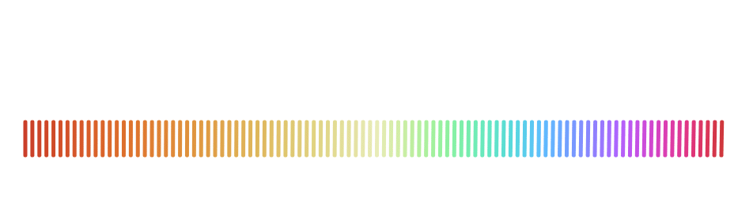
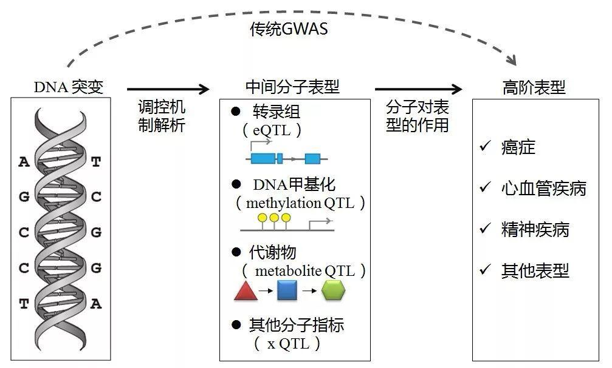
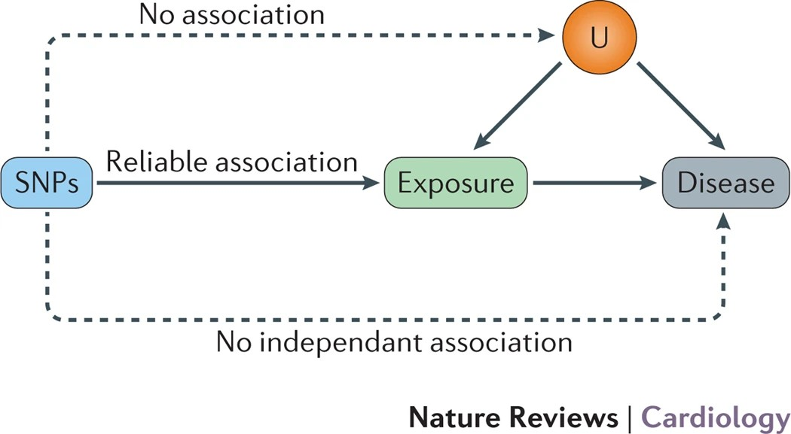
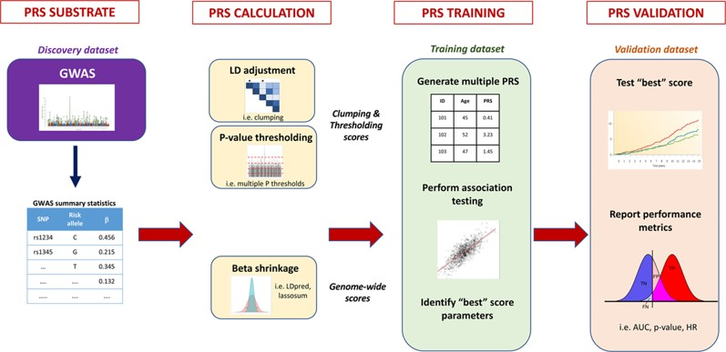

# 🚩**GWAS** 🛞 **MR** 🛞 **P[ro]RS** 🛞 🧬 

  

## 0. Data resources

- [Operating system and WSL notes](./pages/note_OS.md)
- [R setup and package installation notes](./pages/note_R.md)
- [VCF-to-protein and AlphaFold-related notes](./pages/vcf2prot.md)
- [HapMap3 genotype data](https://www.broadinstitute.org/medical-and-population-genetics/hapmap-3): a compact SNP set often used as an LD reference panel.
- [1000 Genomes Project](https://www.internationalgenome.org/data): a widely used reference resource for imputation, LD calculation, and ancestry-aware analyses.
- [UK Biobank Research Analysis Platform](https://dnanexus.gitbook.io/uk-biobank-rap): the recommended cloud environment for large-scale UK Biobank analyses.

 

  

## 1. GWAS 全基因组关联研究

**Start here**

- [GWAS Catalog](https://www.ebi.ac.uk/gwas): useful for finding the GWAS evidence behind many traits.
- [GWAS summary statistics QC checklist](./pages/GWAS.post.md)
- [Genome-build liftOver for GWAS/COJO tables and VCF files](./pages/liftOver.md)
- [GWAS signal annotation resources](./pages/note_annotate.md)

**Public resources and visualization**

- [GWAS Catalog](https://www.ebi.ac.uk/gwas): the classic public catalog of published GWAS associations.
- [PheWeb](https://pheweb.org/): browser for large-scale GWAS/PheWAS results. Examples include [CKB PheWeb](https://pheweb.ckbiobank.org/), [TPMI PheWeb](https://pheweb.ibms.sinica.edu.tw/), and [BBJ PheWeb](https://pheweb.jp/).
- [PheWeb2](https://github.com/GaglianoTaliun-Lab/PheWeb2): a newer implementation for interactive genetic association result browsing.
- [LocusZoom](http://locuszoom.org/): regional association visualization around GWAS loci.

**Recommended reading** 🚩☭

- Chinese tutorial resource: [gwaslab.org](https://gwaslab.org/)
- **2026**. *CBio*. [Transformer-based InsightGWAS improves GERD genetic discovery via pretraining on GWAS for major depressive disorder](https://www.nature.com/articles/s42003-025-09177-3)
- **2026**. *NG*. [Empirically determined baseline masking strategies and other considerations for gene-level burden tests](https://www.nature.com/articles/s41588-026-02597-9)
- **2026**. *NHB*. [Genome-wide meta-analysis of quantitatively measured generalized anxiety symptoms in individuals of European ancestry](https://www.nature.com/articles/s41562-026-02476-7).
- **2024**. NG. <b>谷歌REGLE团队</b>. [Unsupervised representation learning on high-dimensional clinical data improves genomic discovery and prediction](https://www.nature.com/articles/s41588-024-01831-6)
- **2021**. *Nature Reviews Methods Primers*. [Genome-wide association studies](https://www.nature.com/articles/s43586-021-00056-9)

 

  

## 2. MR 孟德尔随机化

**Start here**

- [MR practical notes and common pitfalls](./pages/note_MR.md)

**Common tools**

- Individual-level data: [OneSampleMR](https://cran.r-project.org/web/packages/OneSampleMR/index.html)
- Summary-level data: [TwoSampleMR](https://mrcieu.github.io/TwoSampleMR/index.html) and [MendelianRandomization](https://wellcomeopenresearch.org/articles/8-449)
- MR mediation: `mrMed`/`mrMedR`-style workflows can be considered when the scientific question is exposure → mediator → outcome.

**Recommended reading**

- **2026**. EHJ. [GLP-1R agonists and heart failure: novel beneficial effects suggested by Mendelian randomization](https://academic.oup.com/eurheartj/article-abstract/47/19/2308/8444645?redirectedFrom=fulltext)
- **2022**. Nature Reviews Methods Primers. [Mendelian randomization](https://www.nature.com/articles/s43586-021-00092-5)

 

  

## 3. PRS | PGS | ProtRS 风险预测

**Start here**

- [PRS Catalog](https://www.pgscatalog.org/): public repository of published polygenic score scoring files.
- **2020**. NP. <b>Shing Wan Choi</b> & Paul F. O’Reilly. [Tutorial: a guide to performing polygenic risk score analyses](https://www.nature.com/articles/s41596-020-0353-1)

**Recommended reading** 🚩☭

- **2026**. NP. <b>Pradeep Ratarajan</b> [Development and Validation of a Clinical Polygenic Risk Report in U.S.-Based Health Systems for 8 Cardiovascular Conditions](https://www.jacc.org/doi/10.1016/j.jacc.2026.03.035)
- **2026**. NC. [Integrating common and rare variants improves polygenic risk prediction across diverse populations](https://www.nature.com/articles/s41467-026-72185-2)
- **2026**. NG. [Genetic association and machine learning improve the prediction of type 1 diabetes risk](https://www.nature.com/articles/s41588-026-02578-y)

 

  

 

  

---

🌅 🌙 🦟 🐜 ▸ 🛫 🧬 🫀 🅱️ H 💊
